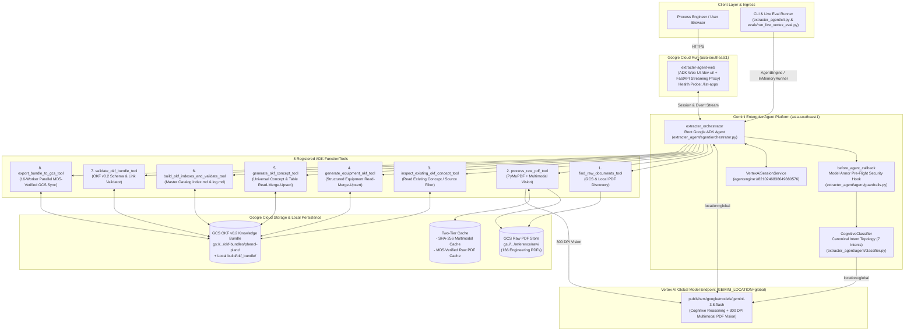

# Chemical Engineering OKF Extracter Agent (`extracter-agent`)

An autonomous, multi-document chemical engineering knowledge extraction and synthesis agent built with the official **Google Agent Development Kit (`google-adk`)** and powered by **`gemini-3.8-flash`** (`GEMINI_LOCATION=global`).

The agent ingests raw engineering PDFs—**Process Equipment Data Sheets**, **Piping & Instrumentation Diagrams (P&IDs)**, **Process Flow Diagrams (PFDs)**, **Operating Manuals**, and **Engineering Standards / SDS**—and compiles them into schema-validated, cross-linked **Open Knowledge Format (`OKF v0.2`)** Markdown knowledge bundles stored in **Google Cloud Storage (GCS)** and on local disk.

---

## 📑 Table of Contents
1. [Introduction & Core Capabilities](#-1-introduction--core-capabilities)
2. [System Architecture](#-2-system-architecture)
3. [Data Sources (`raw` & `wiki`) & Output Bundle](#-3-data-sources-raw--wiki--output-bundle)
4. [Configuration Guide (`.env`)](#-4-configuration-guide-env)
5. [Deploying Agent Runtime & Web Frontend (`deploy.sh`)](#-5-deploying-agent-runtime--web-frontend-deploysh)
6. [Running Evaluations (Equipment ID Mode & Raw PDF File-by-File Mode)](#-6-running-evaluations-equipment-id-mode--raw-pdf-file-by-file-mode)
7. [Running Unit Tests, Property-Based Tests & Static Analysis](#-7-running-unit-tests-property-based-tests--static-analysis)
8. [Repository Structure & Governance References](#-8-repository-structure--governance-references)

---

## 🧪 1. Introduction & Core Capabilities

Chemical process engineering knowledge is fragmented across hundreds of heterogeneous PDFs: multi-sheet mechanical data sheets, vector AutoCAD P&IDs with zero embedded text streams, PFDs with stream heat/material balances, and operating manuals.

The **OKF Extracter Agent** (`extracter_orchestrator`) solves this by combining **cognitive model-driven reasoning**, **300 DPI multimodal visual inspection**, and a **deterministic Python synthesis & reconciliation engine**:

### Dual Extraction Modes
- **Mode A — Entity-Centric (Equipment / Concept ID) Mode:**
  Ask the agent for a specific equipment item (e.g., `D-2304`, `V-2301`, `E-2301`), instrument register (`sis-cdn`, `pressure-instruments`), chemical hazard (`cumene-hydroperoxide`), operating procedure, or plant unit (`unit-23-cdn`). The agent autonomously searches all raw PDFs, reads every relevant datasheet/P&ID/PFD/manual, reconciles parameters across documents, and synthesizes the complete OKF v0.2 `.md` file.
- **Mode B — Raw PDF File-by-File (Document-Centric) Incremental Mode:**
  Feed raw PDF files to the agent **one by one** (e.g., `data_sheets/14780-8120-PS-D2304_Z1.pdf`, then `pid/14780-23-010-01-0004_00.pdf`, then `pfd/PFD-006_CDN.pdf`). For each PDF, the agent creates a `sources/<document-slug>.md` record and incrementally creates or enriches (`Read-Merge-Upsert`) every equipment, instrument, unit, hazard, or procedure concept grounded in that file **without overwriting or losing facts extracted from previously processed PDFs**.

### Revision-Aware Read-Merge-Upsert vs. Cross-Document Conflict Detection
When enriching an existing `.md` concept on disk (`merge_existing=True`), the synthesizer automatically distinguishes between **document revisions** and **engineering discrepancies**:

| Scenario | Example | Agent & Synthesizer Behavior |
| :--- | :--- | :--- |
| **Same Document Updated In-Place or Newer Revision Ingested** | `PS-D2304 Rev Z0` (`3.0 kg/cm²g`) followed by `PS-D2304 Rev Z1` (`3.5 kg/cm²g`), or `DWG-0004_Rev0.pdf` $\rightarrow$ `DWG-0004_Rev1.pdf` | **Updates value in-place (`NO CONFLICT`):** Replaces the old parameter/table value with the new revision's value, updates the citation to `Rev Z1`, and replaces the superseded revision in `frontmatter.sources`. |
| **Different Active Documents Disagree** | Process Data Sheet `PS-D2304` specifies `3.5 kg/cm²g`, whereas P&ID `DWG-23-0004` specifies `5.0 kg/cm²g` | **Flags `⚠️ CONFLICT`:** Preserves both values in the parameter table (`note`) and appends `⚠️ CONFLICT — Design Pressure: PS-D2304 specifies 3.5 kg/cm²g, whereas DWG-23-0004 specifies 5.0 kg/cm²g — verify with engineer before HAZOP` to `## Hazards & Safeguards`. |
| **Different Sheets Within the Same PDF Disagree** | `PS-D2304 Sheet 1 (Cover)` specifies `3.5 kg/cm²g`, whereas `PS-D2304 Sheet 4 (Vessel Sketch)` specifies `3.9 kg/cm²g` | **Flags `⚠️ CONFLICT`:** Preserves both sheet values and emits an explicit `⚠️ CONFLICT` callout in `## Hazards & Safeguards`. |
| **Multiple PDFs Contribute to a Shared Register / Concept** | `pid/DWG-0004.pdf` adds `PT-0401`, `PI-0402` to `instruments/pressure-instruments.md`; later `pid/DWG-0005.pdf` adds `PT-0501`, `PI-0502` | **Non-Destructive Section & Table Merge (`merge_markdown_bodies`):** Preserves all `## <Heading>` sections, merges Markdown table rows by first-column key (`Tag`, `Parameter`, `Stream`), retains safety callouts (`> ⚠️`), and merges `sources`. |

---

## 🏗️ 2. System Architecture

The application enforces a strict separation between the **Interactive Web Frontend on Google Cloud Run (`cloud_run`)** and the **Autonomous Reasoning Engine on the Gemini Enterprise Agent Platform (`agent_runtime`)**, while routing all `gemini-3.8-flash` model calls to the **Global Vertex AI Endpoint (`GEMINI_LOCATION=global`)**.



### Runtime Separation of Responsibilities

| Dimension | Conversational AI Agent & Reasoning Engine | Web Frontend & Streaming Proxy |
| :--- | :--- | :--- |
| **Target Runtime** | **Gemini Enterprise Agent Platform (`agent_runtime`)** | **Google Cloud Run (`cloud_run`)** |
| **Resource / Service** | `projects/114618371568/locations/asia-southeast1/reasoningEngines/8210246838649880576` | `extracter-agent-web` (`https://extracter-agent-web-cwmwtobz3a-as.a.run.app/dev-ui/?app=extracter_agent`) |
| **Model Endpoint** | `GEMINI_LOCATION=global` (`locations/global/publishers/google/models/gemini-3.8-flash`) | `GEMINI_LOCATION=global` (`locations/global/publishers/google/models/gemini-3.8-flash`) |
| **Core Responsibilities** | Multi-turn reasoning, Model Armor pre-flight guardrails, PDF multimodal extraction, incremental Read-Merge-Upsert, and OKF v0.2 validation. | Interactive ADK Developer UI (`/dev-ui/`), SSE/WebSocket event streaming, trace visualization, and session persistence via `agentengine://`. |

> 📊 **Interactive Architecture Diagrams:** See [`docs/extracter-agent-architecture.md`](./docs/extracter-agent-architecture.md) and [`docs/multi-source-extraction-architecture.md`](./docs/multi-source-extraction-architecture.md) (plus their companion standalone HTML visualizers in [`docs/`](./docs/)).

---

## 📂 3. Data Sources (`raw` & `wiki`) & Output Bundle

### 3.1 Raw Engineering Source PDFs (`reference/raw/` & GCS)
The 136 authoritative engineering source PDFs are stored in **both** Google Cloud Storage and the local repository:
- **GCS Location (Primary when `USE_GCS_STORAGE=true`):** `gs://cs-poc-y03r7kmfyov4kilzg50fd7s-okf-knowledge/reference/raw/`
- **Local Path:** [`reference/raw/`](./reference/raw/)

| Subfolder | File Count | Engineering Content |
| :--- | :---: | :--- |
| `reference/raw/data_sheets/` | **55 PDFs** | Process Equipment Data Sheets (`14780-8120-PS-*`) for columns, vessels/drums, shell-and-tube / plate heat exchangers, pumps, ejectors, and coalescers (shell/tube ratings, dimensions, materials, nozzle schedules). |
| `reference/raw/pid/` | **46 PDFs** | Piping & Instrumentation Diagrams (`14780-23-010-01-*`) for Unit 23 Cleavage, Decomposer & Neutralization (vector CAD drawings requiring 300 DPI multimodal vision for field transmitters, control valves, PSVs, and SIS/ESD interlocks). |
| `reference/raw/standards/` | **26 PDFs** | Licensor Engineering Standards, Safety Data Sheets (SDS for CHP, cumene, phenol, acetone, AMS, DMBA), HAZOP methodology/risk matrices, and general instrument specifications. |
| `reference/raw/pfd/` | **8 PDFs** | Process Flow Diagrams (`PFD-001` through `PFD-008`) containing process stream tables, operating temperatures/pressures, and mass/energy balances across Units 21 (Alkylation), 22 (Oxidation), 23 (CDN), and 24 (Distillation). |
| `reference/raw/operating_manuals/` | **1 PDF** | Master Plant Operating Manual (`OM-2000-01.pdf`, 26 pages) covering normal startup/shutdown, emergency shutdown (ESD), thermal runaway prevention, and troubleshooting guides. |
| **Total Raw Corpus** | **136 PDFs** | **100% mapped in `evals/datasets/raw_file_by_file_eval.jsonl` (`724` ground-truth concept mappings).** |

### 3.2 Expert Ground-Truth Wiki (`reference/wiki/`)
[`reference/wiki/`](./reference/wiki/) contains the human-verified **Open Knowledge Format (`OKF v0.2`)** reference knowledge base used as the ground-truth benchmark for evaluation (`evals/datasets/wiki_ground_truth_eval.jsonl`):
- **`equipment/` (65 files):** Individual equipment specifications (`V-2301.md`, `D-2304.md`, `E-2301.md`, `P-2301AB.md`, etc.).
- **`instruments/` (24 files):** Plant-wide and unit-level instrument registers (`sis-cdn.md`, `psv-cdn.md`, `control-valves-cdn.md`, `pressure-instruments.md`, `temperature-instruments.md`, `cause-and-effect-cdn.md`, etc.).
- **`hazards/` (14 files):** Chemical & process hazard profiles (`cumene-hydroperoxide.md`, `phenol.md`, `acetone.md`, `thermal-runaway.md`, etc.).
- **`sources/` (9 files):** Source document catalog summaries.
- **`procedures/` (6 files):** Operating and emergency procedures (`startup-cdn.md`, `normal-shutdown.md`, `emergency-shutdown.md`, etc.).
- **`units/` (4 files):** Process unit overviews (`unit-21-alky.md`, `unit-22-oxi.md`, `unit-23-cdn.md`, `unit-24-dist.md`).
- **`troubleshooting/` (3 files):** Process troubleshooting matrices.
- **`hazop/` (3 grounded standard files):** `methodology.md`, `risk-matrix.md`, `study-info-cdn.md`.
- **`parameters/` (1 file):** Licensor operating windows (`operating-windows.md`).
- **`index.md` & `log.md` (2 files):** Progressive disclosure master catalog and chronological audit log.

> 🔒 **Strict Immutability Rule (Rule 14):** The entire [`reference/`](./reference/) directory (`reference/raw/` and `reference/wiki/`) is **strictly read-only**. Neither the agent nor any tool is permitted to create, modify, or delete files inside `reference/`.

### 3.3 Generated Output Bundle (`build/okf_bundle/` & GCS)
All agent-generated and incrementally merged OKF v0.2 files are written to:
- **Local Output Directory:** `build/okf_bundle/` (configurable via `OUTPUT_BUNDLE_DIR`)
- **GCS Output Prefix (when `USE_GCS_STORAGE=true`):** `gs://cs-poc-y03r7kmfyov4kilzg50fd7s-okf-knowledge/okf-bundles/phenol-plant/` (configurable via `DESTINATION_GCS_BUCKET` and `DESTINATION_GCS_PREFIX`)

---

## ⚙️ 4. Configuration Guide (`.env`)

All parameters for both **Non-Prod** and **Prod** environments are managed in a single unified [`.env`](./.env) file (template in [`.env.example`](./.env.example)) and loaded by [`extracter_agent/config.py`](./extracter_agent/config.py).

### 4.1 Quick Setup
```bash
cp .env.example .env
```

### 4.2 Environment Variables Reference

```ini
# ------------------------------------------------------------------------------
# 1. Core GCP & Gemini Model Configuration
# ------------------------------------------------------------------------------
SERVICE_NAME=extracter-agent
GOOGLE_CLOUD_PROJECT=cs-poc-y03r7kmfyov4kilzg50fd7s
GOOGLE_CLOUD_LOCATION=asia-southeast1      # Region for Cloud Run & Agent Engine sessions
GEMINI_LOCATION=global                     # MUST be 'global' for gemini-3.8-flash on Vertex AI
GOOGLE_GENAI_USE_VERTEXAI=true
GEMINI_MODEL=gemini-3.8-flash
DEPLOYMENT_TARGET=agent_runtime

# ------------------------------------------------------------------------------
# 2. Raw Data Source & Output Bundle Storage (GCS vs. Local Disk)
# ------------------------------------------------------------------------------
USE_GCS_STORAGE=true                       # true = read raw PDFs & write bundle to GCS; false = local disk only
DESTINATION_GCS_BUCKET=cs-poc-y03r7kmfyov4kilzg50fd7s-okf-knowledge
SOURCE_GCS_RAW_PREFIX=reference/raw        # Reads from gs://<DESTINATION_GCS_BUCKET>/<SOURCE_GCS_RAW_PREFIX>/
DESTINATION_GCS_PREFIX=okf-bundles/phenol-plant  # Writes to gs://<DESTINATION_GCS_BUCKET>/<DESTINATION_GCS_PREFIX>/
OUTPUT_BUNDLE_DIR=build/okf_bundle         # Local working bundle directory
REFERENCE_RAW_DIR=reference/raw            # Local raw PDF directory (used when USE_GCS_STORAGE=false)
REFERENCE_WIKI_DIR=reference/wiki          # Local ground-truth wiki directory (read-only)

# ------------------------------------------------------------------------------
# 3. Deployed Runtime Endpoints (Non-Prod & Prod)
# ------------------------------------------------------------------------------
NONPROD_PROJECT_ID=cs-poc-y03r7kmfyov4kilzg50fd7s
NONPROD_REGION=asia-southeast1
NONPROD_GCS_BUCKET=cs-poc-y03r7kmfyov4kilzg50fd7s-okf-knowledge
NONPROD_AGENT_RUNTIME_ID=projects/114618371568/locations/asia-southeast1/reasoningEngines/8210246838649880576
CLOUD_RUN_WEB_SERVICE=extracter-agent-web
CLOUD_RUN_WEB_URL=https://extracter-agent-web-cwmwtobz3a-as.a.run.app
```

#### Switching Between GCS Mode and Local Disk Mode:
- **Cloud-Native GCS Mode (`USE_GCS_STORAGE=true`):**
  - `find_raw_documents_tool` and `process_raw_pdf_tool` list and stream PDFs directly from `gs://<DESTINATION_GCS_BUCKET>/<SOURCE_GCS_RAW_PREFIX>/` (with automatic MD5 digest verification against `/tmp/extracter_gcs_raw_cache/`).
  - `generate_equipment_okf_tool`, `generate_okf_concept_tool`, and `build_okf_indexes_and_validate_tool` write locally to `OUTPUT_BUNDLE_DIR` **and** immediately upload every updated `.md` file to `gs://<DESTINATION_GCS_BUCKET>/<DESTINATION_GCS_PREFIX>/`.
- **Offline / Local Disk Mode (`USE_GCS_STORAGE=false`):**
  - Reads raw PDFs strictly from local `REFERENCE_RAW_DIR` (`reference/raw/`) and writes generated `.md` files only to local `OUTPUT_BUNDLE_DIR` (`build/okf_bundle/`).

---

## 🚀 5. Deploying Agent Runtime & Web Frontend (`deploy.sh`)

The repository includes a unified [`deploy.sh`](./deploy.sh) script that deploys both the **ADK Agent (`agent_runtime`)** on the Gemini Enterprise Agent Platform and the **Interactive ADK Web UI (`cloud_run`)** on Google Cloud Run.

### 5.1 Prerequisites
1. Authenticate with Google Cloud:
   ```bash
   gcloud auth login
   gcloud auth application-default login
   gcloud config set project cs-poc-y03r7kmfyov4kilzg50fd7s
   ```
2. Install Python dependencies in `.venv`:
   ```bash
   python3 -m venv .venv
   .venv/bin/pip install -e ".[dev]"
   ```

### 5.2 Deployment Commands
```bash
# 1. Deploy BOTH the Agent Runtime (Vertex AI Reasoning Engine) AND the Cloud Run Web UI
./deploy.sh

# 2. Deploy ONLY the ADK Agent Backend to Gemini Enterprise Agent Platform (agent_runtime)
./deploy.sh --target agent_runtime

# 3. Deploy ONLY the Interactive ADK Web Frontend to Google Cloud Run (cloud_run)
./deploy.sh --target cloud_run
```

### 5.3 Live Deployed Endpoints & How to Use the Web UI
- **Interactive ADK Web UI (Cloud Run):**
  👉 [`https://extracter-agent-web-cwmwtobz3a-as.a.run.app/dev-ui/?app=extracter_agent`](https://extracter-agent-web-cwmwtobz3a-as.a.run.app/dev-ui/?app=extracter_agent)
- **Vertex AI Agent Engine Runtime ID:**
  `projects/cs-poc-y03r7kmfyov4kilzg50fd7s/locations/asia-southeast1/reasoningEngines/8210246838649880576`

#### Example Prompts to Try in `/dev-ui/`:
- **Raw PDF File-by-File Extraction:**
  > `"Process raw file reference/raw/data_sheets/14780-8120-PS-D2304_Z1.pdf and update all corresponding OKF v0.2 concepts in the bundle."`
- **Incremental P&ID Enrichment on the Same Equipment:**
  > `"Now process raw file reference/raw/pid/14780-23-010-01-0004_00.pdf and enrich the existing OKF v0.2 concepts with all P&ID instrumentation, nozzles, and safety interlocks."`
- **Entity-Centric Equipment Extraction:**
  > `"Extract and synthesize the complete OKF v0.2 equipment specification for Cumene Flash Drum V-2301 across its Process Data Sheet, P&ID, and PFD."`

---

## 📊 6. Running Evaluations (Equipment ID Mode & Raw PDF File-by-File Mode)

The live evaluation runner ([`evals/run_live_vertex_eval.py`](./evals/run_live_vertex_eval.py)) evaluates the agent against live `gemini-3.8-flash` (either locally via `InMemoryRunner` or remotely against the deployed Vertex AI `AgentEngine` via `--use-agent-runtime`) with **zero mocks**.

### 6.1 Mode A: Equipment / Concept ID Evaluation (`--dataset wiki`)
Evaluates the **130 entity-centric ground-truth cases** in [`evals/datasets/wiki_ground_truth_eval.jsonl`](./evals/datasets/wiki_ground_truth_eval.jsonl) (`equipment/`, `instruments/`, `hazards/`, `units/`, `procedures/`, `troubleshooting/`, `parameters/`, `hazop/`, `sources/`) plus **9 core baseline & adversarial security cases** (`139` cases total):

```bash
# Run full 139-case Entity-Centric evaluation against the deployed Agent Runtime (4 parallel workers)
PYTHONPATH=. .venv/bin/python -u evals/run_live_vertex_eval.py \
  --use-agent-runtime \
  --dataset wiki \
  --limit 130 \
  --concurrency 4 \
  --output evals/reports/live_vertex_eval_full.json

# Resume an interrupted evaluation from its checkpoint JSON
PYTHONPATH=. .venv/bin/python -u evals/run_live_vertex_eval.py \
  --use-agent-runtime \
  --dataset wiki \
  --limit 130 \
  --concurrency 4 \
  --resume \
  --output evals/reports/live_vertex_eval_full.json

# Run only a specific category (e.g., wiki_equipment, wiki_instruments, wiki_hazards) or a small sample (--limit 5)
PYTHONPATH=. .venv/bin/python -u evals/run_live_vertex_eval.py \
  --dataset wiki \
  --category wiki_equipment \
  --limit 5 \
  --concurrency 2 \
  --output evals/reports/eval_equipment_sample.json
```

### 6.2 Mode B: Raw PDF File-by-File Evaluation (`--dataset file-by-file`)
Evaluates the **136 document-centric raw PDF cases** in [`evals/datasets/raw_file_by_file_eval.jsonl`](./evals/datasets/raw_file_by_file_eval.jsonl) (covering **100% of the 136 PDFs** in `reference/raw/`) plus the **9 core baseline & security cases** (`145` cases total). Each case prompts the agent to ingest a single raw PDF (`reference/raw/<subfolder>/<filename>.pdf`) and verifies that the agent discovers, parses, and incrementally synthesizes/merges the grounded OKF v0.2 concepts:

```bash
# Run full 136-file Raw PDF File-by-File evaluation against the deployed Agent Runtime
PYTHONPATH=. .venv/bin/python -u evals/run_live_vertex_eval.py \
  --use-agent-runtime \
  --dataset file-by-file \
  --limit 136 \
  --concurrency 4 \
  --output evals/reports/live_vertex_eval_file_by_file.json

# Run File-by-File evaluation for a specific raw PDF subfolder:
# Available categories: raw_data_sheets (55), raw_pid (46), raw_standards (26), raw_pfd (8), raw_operating_manuals (1)
PYTHONPATH=. .venv/bin/python -u evals/run_live_vertex_eval.py \
  --dataset file-by-file \
  --category raw_data_sheets \
  --limit 5 \
  --concurrency 2 \
  --output evals/reports/eval_raw_datasheets_sample.json

# Run BOTH Entity-Centric (130) AND File-by-File (136) datasets in a single unified run
PYTHONPATH=. .venv/bin/python -u evals/run_live_vertex_eval.py \
  --use-agent-runtime \
  --dataset both \
  --limit 266 \
  --concurrency 4 \
  --output evals/reports/live_vertex_eval_combined.json
```

### 6.3 Rebuilding the Ground-Truth Evaluation Datasets
If new reference files are added, regenerate the JSONL evaluation suites with:
```bash
# Rebuild the 130-case Entity-Centric Wiki dataset (evals/datasets/wiki_ground_truth_eval.jsonl)
PYTHONPATH=. .venv/bin/python evals/builders/build_wiki_eval_dataset.py

# Rebuild the 136-case Raw PDF File-by-File dataset (evals/datasets/raw_file_by_file_eval.jsonl)
PYTHONPATH=. .venv/bin/python evals/builders/build_file_by_file_eval_dataset.py
```

---

## 🧪 7. Running Unit Tests, Property-Based Tests & Static Analysis

Every implementation step is verified by deterministic **Unit Tests** and generative **Property-Based Tests (PBT)** using `hypothesis`, plus **Ruff** linting and **Bandit** SAST scanning:

```bash
# Run all 63 Unit, Property-Based (Hypothesis), and Evaluation Dataset Integrity Tests
PYTHONPATH=. .venv/bin/pytest tests/ evals/test_eval_benchmarks.py -q

# Run Ruff static code quality & formatting check
.venv/bin/ruff check extracter_agent/ tests/ evals/

# Run Bandit static application security testing (SAST)
.venv/bin/bandit -r extracter_agent/ -q
```

### Current Verification Metrics

| Metric | Verified Result | Target Standard |
| :--- | :---: | :---: |
| **Unit, Property-Based (`hypothesis`) & Dataset Integrity Tests** | **63 / 63 Passed (`100.0%`)** | `100.0%` (**PASS**) |
| **Golden Wiki Path Parity (`build/okf_bundle/`)** | **130 / 130 (`100.0%`)** | `100.0%` (**PASS**) |
| **Raw PDF File-by-File Dataset Coverage (`reference/raw/`)** | **136 / 136 PDFs (`100.0%`)** | `100.0%` (**PASS**) |
| **Broken Internal Markdown Links** | **`0` Broken Links** | `0` (**PASS**) |
| **Hardcoded Domain Maps / Dataset Tags in `extracter_agent/`** | **`0` (`test_zero_hardcoded_domain_maps_or_tags`)** | `0` (**PASS**) |
| **Ruff Linter & Bandit SAST Security Issues** | **`0` Warnings / `0` Vulnerabilities** | `0` (**PASS**) |

---

## 📁 8. Repository Structure & Governance References

```text
├── AGENTS.md                        # Agent Operating Manual & Project Governance Rules
├── README.md                        # Project overview, architecture, deployment & eval guide
├── .env / .env.example              # Unified environment configuration (GCP, GCS, Non-Prod/Prod)
├── deploy.sh                        # Unified deployment script (--target all|agent_runtime|cloud_run)
├── cloudbuild.yaml                  # Google Cloud Build CI/CD pipeline
├── extracter_agent/                 # Core Google ADK Agent Package
│   ├── agent.py                     # ADK Web / Agent Engine entrypoint (exports root_agent)
│   ├── config.py                    # Pydantic AppConfig loader (.env)
│   ├── cli.py                       # CLI batch runner & bundle utilities
│   ├── agent/
│   │   ├── orchestrator.py          # Root ADK Agent (extracter_orchestrator) & system instructions
│   │   ├── classifier.py            # Cognitive intent classifier (Canonical Intent Topology)
│   │   └── guardrails.py            # Model Armor pre-flight security callback (before_agent_callback)
│   ├── models/
│   │   ├── domain.py                # Equipment, Instrument, Stream & Intent Pydantic schemas
│   │   └── okf_schema.py            # Open Knowledge Format (OKF v0.2) frontmatter & bundle models
│   ├── pdf/
│   │   └── processor.py             # PyMuPDF parser + 300 DPI Gemini multimodal vision + SHA-256 cache
│   ├── okf/
│   │   ├── document.py              # OKF v0.2 YAML frontmatter + Markdown serializer/parser
│   │   ├── synthesizer.py           # Equipment & Markdown table Read-Merge-Upsert + revision/conflict engine
│   │   ├── indexer.py               # Master knowledge catalog (index.md) & audit log (log.md) compiler
│   │   └── validator.py             # OKF v0.2 schema, trust-tier & internal link validator
│   ├── tools/
│   │   ├── pdf_tools.py             # find_raw_documents_tool & process_raw_pdf_tool (MD5-verified GCS cache)
│   │   ├── okf_tools.py             # inspect/generate/validate OKF tools with automatic GCS sync
│   │   └── gcs_tools.py             # export_bundle_to_gcs_tool
│   └── gcs/
│       └── exporter.py              # 16-worker parallel GCS uploader with MD5 digest verification
├── evals/                           # Live Evaluation Suite & Dataset Builders
│   ├── run_live_vertex_eval.py      # Live evaluation runner (--dataset wiki|file-by-file|both)
│   ├── test_eval_benchmarks.py      # Automated dataset integrity & benchmark tests
│   ├── builders/
│   │   ├── build_wiki_eval_dataset.py         # Compiles 130-case entity-centric eval dataset
│   │   └── build_file_by_file_eval_dataset.py # Compiles 136-case raw PDF file-by-file eval dataset
│   └── datasets/
│       ├── wiki_ground_truth_eval.jsonl       # 130 entity-centric ground-truth cases
│       └── raw_file_by_file_eval.jsonl        # 136 raw PDF file-by-file ground-truth cases
├── tests/                           # Unit & Property-Based Test Suite (63 tests)
│   ├── test_okf_unit.py             # OKF synthesis, incremental merge, cache & zero-hardcoding tests
│   ├── test_okf_property.py         # Hypothesis property tests for OKF, merge idempotence & revisions
│   ├── test_agent_unit.py           # ADK orchestrator, tools, guardrails & table merge tests
│   ├── test_agent_property.py       # Hypothesis property tests for guardrails, search & global location
│   ├── test_gcs_unit.py             # GCS exporter & MD5 cache tests
│   └── test_gcs_property.py         # Hypothesis property tests for GCS paths, MIME types & MD5 mutations
├── reference/                       # STRICTLY IMMUTABLE Read-Only Reference Data (Rule 14)
│   ├── raw/                         # 136 Raw Engineering PDFs (data_sheets, pid, pfd, manuals, standards)
│   └── wiki/                        # 130 Ground-Truth OKF v0.2 Markdown files
├── specs/                           # Spec-Driven Development (SDD) Artifacts
│   ├── README.md                    # Specification index
│   ├── baseline/system-overview.md  # System baseline specification
│   ├── features/SPEC-20260922-OKF-EXTRACTER-AGENT.md  # Full feature specification & 17-step plan
│   └── plan/PROGRESS_REPORT_20260922.md               # Living milestone & test progress report
├── docs/                            # Architecture diagrams, SAST audit reports & GCP cost models
└── terraform/                       # Google Cloud Infrastructure Manager Terraform IaC
```

### Key Documentation Links
- **Agent Operating Manual:** [`AGENTS.md`](./AGENTS.md)
- **Feature Specification (SDD):** [`specs/features/SPEC-20260922-OKF-EXTRACTER-AGENT.md`](./specs/features/SPEC-20260922-OKF-EXTRACTER-AGENT.md)
- **Implementation Progress Report:** [`specs/plan/PROGRESS_REPORT_20260922.md`](./specs/plan/PROGRESS_REPORT_20260922.md)
- **System Architecture Diagrams:** [`docs/extracter-agent-architecture.md`](./docs/extracter-agent-architecture.md) | [`docs/multi-source-extraction-architecture.md`](./docs/multi-source-extraction-architecture.md)
- **Security Audit Report (CodeMender):** [`docs/codemender-sast-report.md`](./docs/codemender-sast-report.md)
- **Cloud Cost Estimate:** [`docs/gcp_cost_estimate_extracter_agent.md`](./docs/gcp_cost_estimate_extracter_agent.md)
