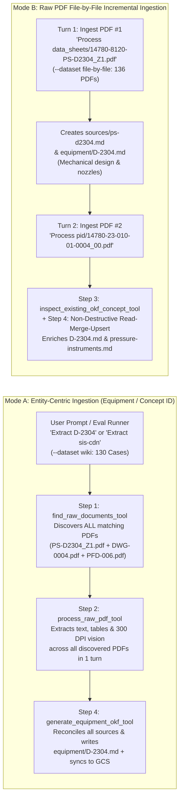
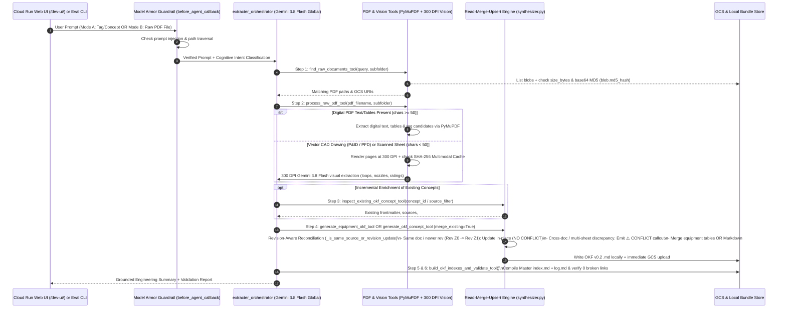

# Dual-Mode Data Ingestion & Autonomous OKF v0.2 Extraction Architecture

> 📊 **Interactive Standalone HTML/SVG Diagram:** Open [`docs/data-ingestion-architecture.html`](./data-ingestion-architecture.html) in any browser (`xdg-open ./docs/data-ingestion-architecture.html`) to view the full dark-themed SVG architecture visualizer.

---

## 1. Architectural Overview

The **Chemical Engineering OKF Extracter Agent** (`extracter_orchestrator`) is an autonomous **Google Agent Development Kit (`google-adk`)** reasoning engine deployed on the **Gemini Enterprise Agent Platform (`agent_runtime`)** in `asia-southeast1` and powered by **`gemini-3.8-flash`** on the **Vertex AI Global Endpoint (`GEMINI_LOCATION=global`)**.

It ingests **136 raw engineering PDFs** (`data_sheets/`, `pid/`, `pfd/`, `operating_manuals/`, `standards/`) from **Google Cloud Storage (`gs://cs-poc-y03r7kmfyov4kilzg50fd7s-okf-knowledge/reference/raw/`)** or local [`reference/raw/`](../reference/raw/) and compiles them into **Open Knowledge Format (`OKF v0.2`)** Markdown knowledge bundles under **`gs://cs-poc-y03r7kmfyov4kilzg50fd7s-okf-knowledge/okf-bundles/phenol-plant/`** and local `build/okf_bundle/`.

---

## 2. Dual Data Ingestion Modes (Mode A vs. Mode B)

The architecture supports two complementary ingestion workflows through the same unified 8-tool ADK agent without any hardcoded tags or regex routing:

| Dimension | Mode A: Entity-Centric (Equipment / Concept ID) | Mode B: Raw PDF File-by-File (Document-Centric) |
| :--- | :--- | :--- |
| **Input Granularity** | Target entity tag or concept topic (e.g., `D-2304`, `V-2301`, `cumene-hydroperoxide`, `sis-cdn`, `unit-23-cdn`). | Single raw PDF path (e.g., `reference/raw/data_sheets/14780-8120-PS-D2304_Z1.pdf` or `reference/raw/pid/14780-23-010-01-0004_00.pdf`). |
| **Discovery Pattern** | Multi-folder search across `data_sheets/`, `pid/`, `pfd/`, `operating_manuals/`, and `standards/` to gather all documents referencing the entity. | Direct ingestion of the specified PDF (`find_raw_documents_tool` $\rightarrow$ `process_raw_pdf_tool`) + inspection of existing concepts via `inspect_existing_okf_concept_tool`. |
| **Synthesis & Persistence** | Synthesizes the complete cross-referenced `.md` concept in a single trajectory (and merges with any existing file on disk). | Always writes/updates `sources/<doc-slug>.md` **and** incrementally creates or merges (`Read-Merge-Upsert`) every equipment, instrument, unit, hazard, or procedure concept in that PDF. |
| **Evaluation Dataset** | [`evals/datasets/wiki_ground_truth_eval.jsonl`](../evals/datasets/wiki_ground_truth_eval.jsonl) (`130` Wiki Cases + `9` Baseline/Security = `139` Cases, `--dataset wiki`). | [`evals/datasets/raw_file_by_file_eval.jsonl`](../evals/datasets/raw_file_by_file_eval.jsonl) (`136` Raw PDFs + `9` Baseline/Security = `145` Cases, `--dataset file-by-file`). |

---

## 3. How the Agent Extracts, Reconciles & Synthesizes Data (6-Step Pipeline)

Every user request or evaluation turn executes a deterministic 6-step pipeline inside [`extracter_orchestrator`](../extracter_agent/agent/orchestrator.py):

### Detailed Breakdown of Each Extraction Stage

#### Stage 0: Pre-Flight Security Guardrail & Cognitive Intent Classification
- **Model Armor Hook ([`before_agent_callback`](../extracter_agent/agent/guardrails.py)):** Intercepts every incoming prompt before LLM tool reasoning to block prompt injection, system instruction overrides, and path traversal attempts (`../`).
- **Cognitive Intent Classifier ([`CognitiveClassifier`](../extracter_agent/agent/classifier.py)):** Uses `gemini-3.8-flash` (`location="global"`) with structured `IntentClassificationResult` output to classify requests into the 7 canonical intents (`EXTRACT_DOCUMENT`, `GENERATE_OKF_CONCEPT`, `BUILD_OKF_BUNDLE`, `VALIDATE_OKF`, `EXPORT_TO_GCS`, `DOMAIN_QA`, `OTHERS`) with zero regex heuristics.

#### Stage 1: Raw Document Discovery & MD5 Cache Verification ([`find_raw_documents_tool`](../extracter_agent/tools/pdf_tools.py))
- Searches across all 5 raw engineering subfolders (`data_sheets/`, `pid/`, `pfd/`, `operating_manuals/`, `standards/`).
- When `USE_GCS_STORAGE=true`, lists blobs directly from `gs://cs-poc-y03r7kmfyov4kilzg50fd7s-okf-knowledge/reference/raw/` and records each blob's `size_bytes`, `md5_hash` (base64 MD5), and `updated` timestamp.
- When downloading a PDF to `/tmp/extracter_gcs_raw_cache/`, verifies **both** file size and base64 MD5 digest (`_compute_file_md5_b64`). If a PDF in GCS was overwritten in-place under the same filename, the cache automatically invalidates and re-downloads the fresh PDF.

#### Stage 2: Hybrid PDF Parsing & 300 DPI Multimodal Vision ([`process_raw_pdf_tool`](../extracter_agent/tools/pdf_tools.py) & [`processor.py`](../extracter_agent/pdf/processor.py))
- **Digital Text & Table Stream (`PyMuPDF`):** Extracts native text blocks, structured tables, and candidate equipment/instrument tags per page.
- **Vector CAD & Raster Detection:** AutoCAD P&IDs (`pid/*.pdf`), PFDs (`pfd/*.pdf`), and scanned mechanical vessel sketches often contain `< 50` embedded characters (`is_vector_drawing: True`).
- **300 DPI Multimodal Visual Extraction (`extract_pdf_multimodal_summary`):**
  - Renders pages at **300 DPI** and sends them to **`gemini-3.8-flash` (`GEMINI_LOCATION=global`)** to visually read instrument bubbles, stacked/redundant loops (`LT-0601/0602/0603`, `FT-0401A/B/C`), control valve failure actions (`FC`/`FO`), PSV set pressures, nozzle schedules, and decimal values (`0.5` vs `5.0 kg/cm²g`).
  - **Two-Tier SHA-256 Vision Cache:** Caches multimodal extraction results by file SHA-256 digest in `/tmp/extracter_multimodal_cache/` and `gs://.../cache/multimodal/`, attaching the multimodal transcript once per PDF to prevent context window bloat.

#### Stage 3: Bundle State Inspection ([`inspect_existing_okf_concept_tool`](../extracter_agent/tools/okf_tools.py))
- Before updating shared concepts (`equipment/<TAG>`, `instruments/<register>`, `units/<unit>`, `hazards/<chemical>`), the agent can inspect the existing `.md` file by `concept_id` or query all concepts citing a specific PDF via `source_filter`.
- Returns existing frontmatter `sources`, `tags`, `entity_metadata`, and `body_markdown` so the agent reuses existing `## <Heading>` names and Markdown table columns.

#### Stage 4: Revision-Aware Read-Merge-Upsert & Conflict Detection ([`synthesizer.py`](../extracter_agent/okf/synthesizer.py))
Both synthesis tools perform **non-destructive Read-Merge-Upsert (`merge_existing=True` by default)**:

1. **Structured Equipment Merging ([`merge_equipment_entity_with_existing`](../extracter_agent/okf/synthesizer.py#L610-L756)):**
   - Parses the existing `equipment/<TAG>.md` document (`## Design Data`, `## Operating Conditions`, `## Instrumentation & Control Loops (P&ID)`, `## Connections & Stream Summary`, `## Hazards & Safeguards`, `## Function`).
   - Merges `design_data` and `operating_conditions` by normalized parameter name using [`_is_same_source_or_revision_update`](../extracter_agent/okf/synthesizer.py#L510-L522):
     - **Same Document or Newer Revision (`PS-D2304 Rev Z0` $\rightarrow$ `PS-D2304 Rev Z1`):** Updates the value and source citation **in-place** without generating a conflict warning, and replaces the superseded revision in `frontmatter.sources`.
     - **Different Active Documents (`PS-D2304` vs. `DWG-23-0004`) or Different Sheets (`Sheet 1 Cover` vs. `Sheet 4 Sketch`):** Preserves both values in the table `note` column and automatically appends `⚠️ CONFLICT — <Parameter>: <Doc A> specifies <Val A>, whereas <Doc B> specifies <Val B> — verify with engineer before HAZOP` to `## Hazards & Safeguards`.
   - Merges `instruments` by normalized `tag` and `connections` by `stream_id`, and dynamically resolves every instrument tag link against actual `instruments/*.md` registers in the bundle via [`resolve_bundle_instrument_link`](../extracter_agent/okf/synthesizer.py#L72-L162) (zero hardcoded ISA prefix tables).

2. **Non-Equipment Concept & Shared Register Table Merging ([`merge_markdown_bodies`](../extracter_agent/okf/synthesizer.py#L879-L934)):**
   - Used by [`generate_okf_concept_tool`](../extracter_agent/tools/okf_tools.py#L221-L361) for `instruments/`, `units/`, `hazards/`, `procedures/`, `troubleshooting/`, `parameters/`, `hazop/`, and `sources/`.
   - Splits existing and incoming Markdown bodies into `## <Heading>` blocks, retains any `## <Heading>` sections from earlier PDFs omitted in the new turn, merges Markdown table rows by normalized first-column key (`Tag`, `Parameter`, `Stream`), applies revision-aware source supersession on the `Source`/`Drawing` column, and preserves top-level `> ⚠️ **CRITICAL PROCESS SAFETY / DISCREPANCY WARNING:**` blockquotes and bullet lists.

#### Stage 5 & 6: Master Catalog Indexing, OKF v0.2 Validation & Parallel GCS Sync ([`indexer.py`](../extracter_agent/okf/indexer.py), [`validator.py`](../extracter_agent/okf/validator.py), [`exporter.py`](../extracter_agent/gcs/exporter.py))
- Compiles the progressive disclosure Master Catalog (`index.md`, `equipment/index.md`) and chronological audit log (`log.md`).
- Validates 100% OKF v0.2 YAML frontmatter compliance, trust-tier monotonicity, and **zero broken internal Markdown links**.
- Syncs all updated files to `gs://cs-poc-y03r7kmfyov4kilzg50fd7s-okf-knowledge/okf-bundles/phenol-plant/` using a 16-worker `ThreadPoolExecutor` with base64 MD5 digest verification (`compute_file_md5_b64` vs. `blob.md5_hash`).
