# Step-by-Step Multi-Source OKF Extraction Architecture

> **Target Entity:** Concentration Cumene Quench Drum (`D-2301`, Unit: `CDN`)  
> **Extraction Mode:** Multi-Source Cross-Document Ingestion & Reconciliation  
> **Foundation Model:** `gemini-3.8-flash` (via Google ADK on Google Cloud Vertex AI)  
> **Execution Status:** 100% Validated (`is_valid_okf: true`, 0 schema violations)  
> **Target Output:** [`build/okf_bundle/equipment/D-2301.md`](../build/okf_bundle/equipment/D-2301.md) (21,542 bytes)  
> **Companion Interactive Diagram:** [Open Standalone HTML Diagram Asset](./multi-source-extraction-architecture.html)

---

## 1. Executive Summary

Chemical engineering knowledge synthesis cannot rely on single-document extraction. Equipment specifications, operating envelopes, and process safety safeguards are distributed across disparate document formats:
1. **Mechanical Process Data Sheets (`reference/raw/data_sheets/`):** Define internal diameter, tangent length, metallurgy, head geometries, and vessel internals (partitions, distributors, vortex breakers).
2. **P&ID Drawings (`reference/raw/pid/`):** AutoCAD vector drawings defining field transmitters, control loops, interlock valves, line tags, and hydrostatic installation elevations.
3. **Process Flow Diagrams (`reference/raw/pfd/`):** Define heat and mass balances, operating pressures, and normal operating temperatures.
4. **Safety & Cause-and-Effect Matrices:** Define emergency shutdown logic (ESD `UC-2301`), SIS isolation valves (`UXV-23-0601`), and solenoid dump pilots (`UXY-23-0601`).
5. **Operating Manuals (`reference/raw/operating_manuals/`):** Specify exothermic thermal runaway limits, auto-decomposition hazards, and emergency quench requirements.

This architecture report documents the step-by-step autonomous trajectory executed by the **Extracter Agent** using **Google ADK** and **Gemini 3.8 Flash** on live Vertex AI to ingest, reconcile, and synthesize the authoritative Open Knowledge Format (**OKF v0.2**) representation for `D-2301`.

---

## 2. Interactive Architecture Visualizer

The standalone dark-themed interactive SVG diagram is available at:
👉 **[`docs/multi-source-extraction-architecture.html`](./multi-source-extraction-architecture.html)**

To preview in local environments:
```bash
# macOS
open ./docs/multi-source-extraction-architecture.html

# Linux
xdg-open ./docs/multi-source-extraction-architecture.html
```

---

## 3. Step-by-Step Trajectory Flowchart

```mermaid
sequenceDiagram
    autonumber
    actor Engineer as Process Engineer / Eval Harness
    participant Guardrail as Model Armor (before_agent_callback)
    participant Agent as ADK Root Orchestrator (gemini-3.8-flash)
    participant Discovery as find_raw_documents_tool
    participant PDFTool as process_raw_pdf_tool
    participant GeminiVision as Vertex AI Multimodal Vision
    participant OKFTool as generate_equipment_okf_tool
    participant IndexTool as build_okf_indexes_and_validate_tool
    participant Storage as OKF Bundle (build/okf_bundle/)

    Engineer->>Guardrail: Dispatch Extraction Request (Tag: D-2301, Multi-Source)
    Guardrail->>Guardrail: Scan prompt security (0 match, clean) & lock reference/ as read-only
    Guardrail->>Agent: Forward sanitized prompt to ADK Session

    rect rgb(15, 23, 42)
        Note over Agent, Discovery: STEP 1: Cognitive Document Discovery
        Agent->>Discovery: find_raw_documents_tool(query="D-2301")
        Discovery-->>Agent: Discovered Data Sheets, P&IDs, PFDs, C&E matrices
    end

    rect rgb(20, 30, 48)
        Note over Agent, GeminiVision: STEP 2: Dual-Stream Ingestion & Multimodal Vision
        Agent->>PDFTool: process_raw_pdf_tool(data_sheets/PS-D2301)
        PDFTool->>GeminiVision: Multimodal visual extraction of Scanned Page 4 (Mechanical Schedule)
        GeminiVision-->>PDFTool: Dimensions (2800x9400mm), Internals (Partition, Type C, VB)
        PDFTool-->>Agent: Mechanical specification payload

        Agent->>PDFTool: process_raw_pdf_tool(pid/25-23-0006)
        Note over PDFTool: Detects is_vector_drawing: True (0 font streams)
        PDFTool->>GeminiVision: Multimodal CAD visual parsing of Drawing 0006
        GeminiVision-->>PDFTool: Elevation (5000mm head), Lines (-006001..006013), Instrumentation
        PDFTool-->>Agent: P&ID engineering payload

        Agent->>PDFTool: process_raw_pdf_tool(pfd/20-23-0001)
        PDFTool-->>Agent: Operating conditions (38 °C, 0.06 kg/cm²g)
        Agent->>PDFTool: process_raw_pdf_tool(pid/25-23-0002 C&E Table)
        PDFTool-->>Agent: SIS trip logic (UXV-23-0601 / UXY-23-0601)
        Agent->>PDFTool: process_raw_pdf_tool(operating_manuals/OM-Phenol Unit)
        PDFTool-->>Agent: Chemical runaway kinetics (100-120 °C decomposition)
    end

    rect rgb(35, 15, 25)
        Note over Agent: STEP 3: Cognitive Precedence & Discrepancy Reconciliation
        Agent->>Agent: Reconcile Data Sheet INT pressure (0.5 kg/cm²g) vs P&ID note (3.9 kg/cm²g PSV setpoint)
        Agent->>Agent: Link LT-23-0601 (0-32 mBar) to LIC-23-0601 and LV-23-0601 (Fail-Close)
    end

    rect rgb(25, 20, 45)
        Note over Agent, Storage: STEP 4: OKF v0.2 Knowledge Synthesis & Validation
        Agent->>OKFTool: generate_equipment_okf_tool(tag="D-2301", sources=[...], design_data=[...], ...)
        OKFTool->>Storage: Write build/okf_bundle/equipment/D-2301.md (21,542 bytes)
        OKFTool-->>Agent: Success (stable, human-reviewed trust tier)

        Agent->>IndexTool: build_okf_indexes_and_validate_tool()
        IndexTool->>Storage: Update equipment/index.md & append log.md
        IndexTool-->>Agent: is_valid_okf: true (0 errors, 0 schema violations)
    end

    Agent-->>Engineer: Final Report with file:// links & provenance citations
```



---

## 4. Multi-Source Ingestion Corpus Breakdown

The following authoritative documents were ingested from `reference/raw/` during this single evaluation run:

| Source ID | Document Path in `reference/raw/` | Discipline / Modality | Engineering Authority & Data Yield |
| :--- | :--- | :--- | :--- |
| **`src-1`** | `data_sheets/14780-8120-PS-D2301_D-2301 PROCESS DATA SHEET_Z1.pdf` | Mechanical Data Sheet (Hybrid) | **Governing Mechanical Authority:** Shell diameter ($2,800\text{ mm}$), tangent length ($9,400\text{ mm}$), design pressure ($0.5\text{ kg/cm}^2\text{g}$ INT / $\text{FV}$ EXT), design temperature ($120^\circ\text{C}$ INT / $195^\circ\text{C}$ EXT), Killed Carbon Steel, $3\text{ mm}$ corrosion allowance, internal weir partition ($10\text{ mm}$), UOP Type C distributor, $150\text{ mm}$ vortex breaker. |
| **`src-2`** | `pid/14780-8120-25-23-0006_P&ID CDN UNIT CONCENTRATION CUMENE QUENCH_Z1.pdf` | AutoCAD Vector Drawing (Vision) | **Governing Field Piping & Elevation Authority:** $5,000\text{ mm}$ minimum hydrostatic elevation head above Flash Column (`V-2302`) bottom tray quench nozzle; free-draining unpocketed piping layout; field instruments (`LT-23-0601`, `LIC-23-0601`, `LV-23-0601`, `UXV-23-0601`, `UXY-23-0601`, `RO-23-0601`, `HIC-23-0601`). |
| **`src-3`** | `pfd/14780-8120-20-23-0001_CDN PROCESS FLOW DIAGRAM CUMENE QUENCH TANK _Z1.pdf` | Process Flowsheet (Vision) | **Governing Operating Conditions:** Liquid operating temperature ($38^\circ\text{C}$), vessel operating pressure ($0.06\text{ kg/cm}^2\text{g}$), Normal Liquid Level ($\text{NLL} = 840\text{ mm}$ above centerline $\approx 2,240\text{ mm}$ from bottom), specific gravity ($0.84$). |
| **`src-4`** | `data_sheets/14780-8120-PS-0033_LEVEL INSTRUMENT PROCESS DATA SHEET (CDN)_Z1.pdf` | Instrument Data Sheet (Text) | **Instrument Calibration Authority:** `LT-23-0601` differential pressure transmitter span ($0\text{ to }32\text{ mBar}$), 316SS diaphragm, silicone fill fluid, armored reflex level gauge `LGR-23-0602` ($640\text{ mm}$ visible C-to-C). |
| **`src-5`** | `data_sheets/14780-8120-PS-0010_CONTROL VALVE PROCESS DATA SHEET CDN UNIT_Z1.pdf` | Valve Specification (Text) | **Control Valve Mechanical Authority:** `LV-23-0601` 3-inch globe valve, Class 150/300 RF body, Fail-Close pneumatic actuator action. |
| **`src-6`** | `pid/14780-8120-25-23-0002_P&ID CDN UNIT CAUSE AND EFFECT TABLE_Z1.pdf` | Safety Interlock Matrix (Vision) | **SIS Trip Logic Authority:** ESD `UC-2301` initiation triggers `UXY-23-0601` solenoid to vent air and instantly close `UXV-23-0601`, isolating the quench system during plant emergencies. |
| *(Ref)* | `operating_manuals/OM-Phenol Unit UOP-2015.pdf` | Operating Manual (Text) | **Process Safety Kinetics:** Concentrated CHP ($80\text{--}82\text{ wt}\%$) autocatalytic decomposition threshold ($100\text{--}120^\circ\text{C}$, $\Delta H_{\text{rxn}} \approx -252\text{ kJ/mol}$), emergency quench dilution mechanisms. |

---

## 5. Detailed Step-by-Step Technical Breakdown

### Step 1: Pre-Flight Guardrails & Security Interception
* Every prompt entering the ADK runtime passes through `before_agent_callback` (`extracter_agent/agent/guardrails.py`).
* Model Armor inspects prompt token embeddings for jailbreaks, system prompt overrides, and unauthorized mutation commands.
* **Negative Constraint Enforcement:** The hook enforces read-only access to `reference/` (Rules 5 & 14). Any instruction attempting to modify files in `reference/` is intercepted before tool invocation.

### Step 2: Cognitive Document Discovery
* The agent invokes `find_raw_documents_tool(query="D-2301")`.
* The tool scans `reference/raw/` across all 5 subfolders (`data_sheets`, `pid`, `pfd`, `operating_manuals`, `standards`).
* Returning matches categorized by directory and file size, enabling the LLM to identify the full multi-document engineering package.

### Step 3: Dual-Stream Ingestion & Multimodal Vector Vision
* **AutoCAD Vector Drawing Handling:** Standard Python PDF parsers (`pypdf`, `pdfplumber`) rely on `/Font` dictionaries. AutoCAD vector exports render text labels as bezier stroke outlines, returning 0 characters.
* **Dynamic Vision Trigger:** `process_raw_pdf_tool` checks `is_vector_drawing(target_path)`. When font text is absent or `< 100` characters, the tool wraps raw PDF bytes via `google.genai.types.Part.from_bytes(data=pdf_bytes, mime_type="application/pdf")`.
* **Gemini 3.8 Flash Multimodal Call:** Gemini 2.5/3.8 Flash visually extracts fine engineering annotations:
  - Instrument bubble tags (`LT-23-0601`, `LIC-23-0601`, `LV-23-0601`, `UXV-23-0601`)
  - Mechanical notes: *"5000 MIN ABOVE QUENCH NOZZLE AT BOTTOM TRAY OF FLASH COLUMN"*
  - Piping designations: *"FREE DRAINING - NO POCKETS"*

### Step 4: Engineering Precedence & Conflict Reconciliation
When data points conflict across documents, the agent applies the 6-Tier Engineering Precedence Hierarchy:
1. **Mechanical Design Ratings:** The Process Data Sheet (`PS-D2301 Rev Z1 As-Built`) is the primary governing authority.
2. **Conflict Resolution:** P&ID `0006` annotates design pressure as $3.5 / 3.9\text{ kg/cm}^2\text{g}$, while `PS-D2301` states $0.5\text{ kg/cm}^2\text{g}$ INT / $\text{FV}$ EXT. The agent reconciles that $3.9\text{ kg/cm}^2\text{g}$ is the PSV setpoint, adopts the Data Sheet rating ($0.5\text{ kg/cm}^2\text{g}$), and inserts an explicit conflict disclosure note.
3. **Instrumentation & Control:** P&ID `0006` and C&E `0002` govern field sensors, control loops, and SIS shutdown trip valves.
4. **Safety & Hazards:** Operating manual governs peroxide runaway kinetics ($\ge 100^\circ\text{C}$).

### Step 5: Structured OKF v0.2 Knowledge Synthesis
* The agent invokes `generate_equipment_okf_tool` with typed arguments.
* The synthesizer (`extracter_agent/okf/synthesizer.py`) compiles the OKF v0.2 document:
  - Quoted YAML frontmatter preserving tag strings without octal truncation.
  - Multi-source citations with complete document titles and relative paths.
  - Formatted Markdown sections: Function, Design Data, Operating Conditions, ASCII Instrumentation Architecture, Piping Connections, and Hazards.
* Written to `build/okf_bundle/equipment/D-2301.md`.

### Step 6: Progressive Disclosure Indexing & Conformance Validation
* `build_okf_indexes_and_validate_tool` updates `equipment/index.md` and appends an entry to `log.md`.
* `validate_okf_bundle_tool` runs strict Pydantic schema validation:
  - Verified 100% of concept links resolve to physical files.
  - Verified 0 broken image/document references.
  - Verified trust tier assignment (`human-reviewed: 7` documents).
  - Confirmed `is_valid_okf: true`.

---

## 6. Synthesized Knowledge Artifact Details

- **File Path:** [`build/okf_bundle/equipment/D-2301.md`](../build/okf_bundle/equipment/D-2301.md)
- **Total Lines:** 245 lines
- **File Size:** 21,542 bytes
- **Citations:** 6 distinct raw engineering source documents cited
- **Control Loops Mapped:** 12 instrument and valve tags with complete DCS alarm setpoints and fail-safe actions
- **Safety Safeguards Documented:** 5 critical process safety mitigations (autocatalytic runaway prevention, gravity quench head, vortex breaker pull-through prevention, full vacuum collapse prevention, hydraulic piping symmetry)
