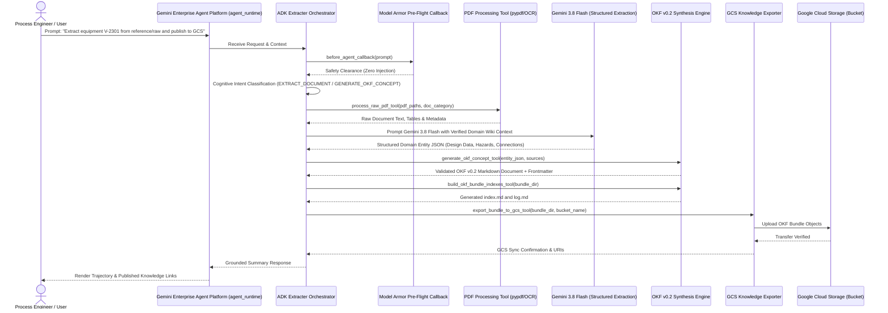

# Specification: Autonomous OKF Extracter Agent on Google ADK & Gemini Enterprise Agent Platform

**Document ID:** SPEC-20260922-OKF-EXTRACTER-AGENT  
**Status:** Approved  
**Date:** 2026-09-22  
**Target Project:** `cs-poc-y03r7kmfyov4kilzg50fd7s`  
**Git Repository:** `https://github.com/pantana-na/extracter-agent.git`  
**Target Runtime:** Gemini Enterprise Agent Platform (`agent_runtime`)  

---

## 1. Problem Statement & Objectives

### 1.1 Context & Motivation
Industrial engineering facilities (e.g. the PTT Phenol Company Limited Train II chemical plant) generate voluminous, heterogeneous technical documentation across process data sheets, Piping & Instrumentation Diagrams (P&IDs), Process Flow Diagrams (PFDs), operating manuals, and design standards. Historically, converting these raw engineering PDFs into structured knowledge required manual analysis by human process safety and chemical engineering experts (as captured in `reference/wiki/`).

To scale knowledge extraction, eliminate manual ingestion bottlenecks, and enable intelligent enterprise reasoning, we are developing the **Extracter Agent**. Built on the official **Google Agent Development Kit (`google-adk`)**, this autonomous agent runs on the **Gemini Enterprise Agent Platform (`agent_runtime`)**. It combines dedicated PDF document processing pipelines with **Gemini 3.8 Flash** model-driven extraction to generate structured knowledge conforming strictly to the **Open Knowledge Format (OKF v0.2)**, targeting **Google Cloud Storage (GCS)** as the authoritative destination.

### 1.2 Goals
1. **Official Google ADK Architecture:** Build an autonomous multi-agent reasoning system using `google-adk` (`Agent`, `FunctionTool`, `before_agent_callback`) packaged for Gemini Enterprise Agent Platform deployment (`agents-cli deploy --deployment-target agent_runtime`).
2. **Cognitive Model-Driven Reasoning:** Rely exclusively on model-driven reasoning via Gemini 3.8 Flash structured schemas and canonical intent topology; zero regex routing, keyword heuristics, or hardcoded fallback lists.
3. **Engineering PDF Extraction Pipeline:** Extract technical parameters, operating limits, equipment metallurgy, design specifications, P&ID instrumentation loops, HAZOP nodes, and process chemistry from complex PDFs in `reference/raw/`.
4. **OKF v0.2 Knowledge Construction:** Compile extracted domain data into fully compliant Open Knowledge Format bundles featuring YAML frontmatter (`type`, `title`, `description`, `sources` with credibility signals, `generated`, `verified`, `status`, `entity_metadata`) and structured Markdown bodies with per-claim footnote attribution (`[^source_id]`).
5. **GCS Knowledge Publishing:** Export and synchronize OKF knowledge bundles directly into target Google Cloud Storage buckets (`gs://<bucket>/<prefix>/...`) with atomic sync and content-type integrity.
6. **Progressive Disclosure & Navigation:** Automatically generate hierarchical directory indexes (`index.md`) and chronological update logs (`log.md`) matching OKF v0.2 specifications.
7. **Adherence to Repository Governance:** Strictly comply with SDD (Unit + Property-Based Tests at every step), DevSecOps (CodeMender SAST), unified `.env` configuration, and immutable reference boundaries.

### 1.3 Non-Goals
- Modifying or altering any contents within the read-only `reference/` directory (strictly immutable).
- Building bespoke proprietary frontend metadata formats; OKF v0.2 is the universal vendor-neutral standard.
- Hardcoded string extraction rules or heuristic regex scrapers.

---

## 2. System Architecture & Component Interaction

### 2.1 Runtime Boundary & Separation of Responsibilities

| Dimension | Autonomous AI Agents & Reasoning Engine | Web Frontend & API Streaming Proxies | Object Storage & Knowledge Repo |
| :--- | :--- | :--- | :--- |
| **Target Runtime** | **Gemini Enterprise Agent Platform (`agent_runtime`)** | **Google Cloud Run (`cloud_run`)** | **Google Cloud Storage (`storage.googleapis.com`)** |
| **Deployed Artifacts** | ADK Root Orchestrator (`ExtracterAgent`), extraction subagents, cognitive prompt topology, Model Armor security callback, and `FunctionTool` registries. | React/Vite web application, FastAPI streaming proxy, health probes (`/healthz`). | OKF knowledge bundles (`index.md`, `log.md`, `equipment/`, `hazards/`, `hazop/`, `instruments/`, `units/`). |
| **Deployment Mechanism** | `agents-cli deploy --deployment-target agent_runtime` | Google Cloud Build (`cloudbuild.yaml`) + Terraform via Infrastructure Manager | Automated ADK tool export or Cloud Build deployment |
| **Core Responsibilities** | Document ingestion, cognitive multimodal PDF extraction, OKF schema synthesis, GCS sync, live eval (`agents-cli eval`). | User interaction, authentication gateway (IAP/OAuth2), SSE streaming proxy to Agent Platform. | Durable storage, progressive disclosure serving, cross-system knowledge distribution. |
| **Governance Rule** | `_agents/rules/google_adk_and_agent_runtime.md` | `_agents/rules/devops_security_and_quality_standards.md` | `_agents/rules/spec_driven_development.md` |

### 2.2 Sequence Diagram: Cognitive Extraction & OKF Generation



### 2.3 Canonical Intent Topology (MECE)
Intent classification is strictly cognitive and model-driven using Gemini 3.8 Flash:
1. `EXTRACT_DOCUMENT`: Parse raw technical PDF documents (`reference/raw/`) and extract domain entities.
2. `GENERATE_OKF_CONCEPT`: Transform extracted domain entities into an individual OKF v0.2 concept document with frontmatter and body.
3. `BUILD_OKF_BUNDLE`: Process a collection of documents, generate concept categories (`equipment/`, `hazards/`, `hazop/`, `instruments/`, `parameters/`, `procedures/`, `units/`), and build progressive disclosure index files (`index.md`) and change logs (`log.md`).
4. `EXPORT_TO_GCS`: Upload and synchronize an OKF knowledge bundle directory to the designated GCS bucket.
5. `VALIDATE_OKF_BUNDLE`: Execute formal OKF v0.2 validation on a bundle (verifying frontmatter schemas, link integrity, and freshness).
6. `OTHERS`: Polite out-of-scope guidance explaining extraction and OKF synthesis capabilities.

---

## 3. Data Models & Type Contracts

All data structures are codified as strict Pydantic v2 models in `extracter_agent/models/`:

```python
from enum import Enum
from typing import Any, Optional
from pydantic import BaseModel, Field


class IntentCategory(str, Enum):
  EXTRACT_DOCUMENT = "EXTRACT_DOCUMENT"
  GENERATE_OKF_CONCEPT = "GENERATE_OKF_CONCEPT"
  BUILD_OKF_BUNDLE = "BUILD_OKF_BUNDLE"
  EXPORT_TO_GCS = "EXPORT_TO_GCS"
  VALIDATE_OKF_BUNDLE = "VALIDATE_OKF_BUNDLE"
  OTHERS = "OTHERS"


class IntentClassificationResult(BaseModel):
  intent: IntentCategory
  confidence: float = Field(ge=0.0, le=1.0)
  reasoning: str
  target_entities: list[str] = Field(default_factory=list)
  raw_sources: list[str] = Field(default_factory=list)


class OKFSource(BaseModel):
  id: str
  resource: str
  title: Optional[str] = None
  author: Optional[str] = None
  usage_count: Optional[int] = None
  last_modified: Optional[str] = None


class OKFActor(BaseModel):
  by: str
  at: str


class OKFConceptStatus(str, Enum):
  DRAFT = "draft"
  STABLE = "stable"
  DEPRECATED = "deprecated"


class OKFFullFrontmatter(BaseModel):
  type: str
  title: Optional[str] = None
  description: Optional[str] = None
  resource: Optional[str] = None
  tags: list[str] = Field(default_factory=list)
  sources: list[OKFSource] = Field(default_factory=list)
  generated: Optional[OKFActor] = None
  verified: list[OKFActor] = Field(default_factory=list)
  status: OKFConceptStatus = OKFConceptStatus.STABLE
  stale_after: Optional[str] = None
  entity_metadata: dict[str, Any] = Field(default_factory=dict)


class EquipmentDesignParameter(BaseModel):
  parameter: str
  value: str
  unit: Optional[str] = None
  source_citation: str


class EquipmentExtractionPayload(BaseModel):
  tag: str
  name: str
  equipment_type: str
  unit: str
  description: str
  design_data: list[EquipmentDesignParameter] = Field(default_factory=list)
  operating_conditions: list[EquipmentDesignParameter] = Field(
      default_factory=list
  )
  hazards: list[str] = Field(default_factory=list)
  connections: list[dict[str, str]] = Field(default_factory=list)
  source_files: list[str] = Field(default_factory=list)


class GCSUploadResult(BaseModel):
  bucket: str
  prefix: str
  files_uploaded: list[str]
  total_bytes: int
  gcs_root_uri: str
```

---

## 4. ADK FunctionTool Contracts & Registries

### 4.1 Tool: `process_raw_pdf_tool`
- **Docstring:**
  ```text
  Extract raw textual content, structural tables, and engineering annotations from PDF documents in reference/raw/.
  When to use: Ingesting process data sheets, P&IDs, PFDs, or operating manuals for knowledge extraction.
  When NOT to use: Do not use for already extracted Markdown files or general conversational chat.
  ```
- **Arguments:**
  - `pdf_path` (str): Absolute or project-relative path to the PDF file.
  - `doc_category` (str): Category (`data_sheets`, `pid`, `pfd`, `operating_manuals`, `standards`).
- **Returns:**
  - `dict`: Formatted text pages, extracted tables, and document metadata.

### 4.2 Tool: `generate_okf_concept_tool`
- **Docstring:**
  ```text
  Construct a validated Open Knowledge Format (OKF v0.2) concept document with frontmatter and Markdown body.
  When to use: Generating compliant knowledge files for equipment, hazards, HAZOP, instruments, or units.
  When NOT to use: Do not use for modifying immutable reference/ files or writing raw unconverted notes.
  ```
- **Arguments:**
  - `concept_id` (str): Relative path without extension (e.g. `equipment/V-2301`).
  - `concept_type` (str): Descriptive OKF type (e.g. `Equipment Concept`).
  - `title` (str): Human-readable concept title.
  - `description` (str): Concise single-sentence summary.
  - `tags` (list[str]): Categorical tags.
  - `sources` (list[dict]): Provenance sources with id, resource, and author.
  - `body_markdown` (str): Structured Markdown body with footnotes.
  - `entity_metadata` (dict): Domain-specific properties.
- **Returns:**
  - `dict`: Full OKF Markdown document string, validation verdict, and output path.

### 4.3 Tool: `build_okf_bundle_indexes_tool`
- **Docstring:**
  ```text
  Generate progressive disclosure index.md files for every directory in the OKF bundle, plus log.md.
  When to use: Completing an OKF bundle prior to deployment or after adding/updating concept files.
  When NOT to use: Do not use on non-OKF directories.
  ```
- **Arguments:**
  - `bundle_dir` (str): Path to the root of the generated OKF bundle directory.
- **Returns:**
  - `dict`: List of generated index files, entry counts, and log path.

### 4.4 Tool: `export_bundle_to_gcs_tool`
- **Docstring:**
  ```text
  Upload and synchronize an entire OKF knowledge bundle directory to Google Cloud Storage (GCS).
  When to use: Publishing a completed, validated OKF bundle to the enterprise destination bucket.
  When NOT to use: Do not use if the bundle fails OKF validation or contains malformed frontmatter.
  ```
- **Arguments:**
  - `bundle_dir` (str): Path to the local bundle directory.
  - `gcs_bucket` (str): Target GCS bucket name.
  - `gcs_prefix` (str): Target prefix folder within the bucket.
- **Returns:**
  - `dict`: Upload confirmation, object URIs, total bytes, and timestamp.

### 4.5 Tool: `validate_okf_bundle_tool`
- **Docstring:**
  ```text
  Execute rigorous OKF v0.2 validation verifying frontmatter schemas, link integrity, and progressive indexes.
  When to use: Verifying quality and standards compliance of an OKF bundle before publishing.
  When NOT to use: Do not use on raw unstructured PDF files.
  ```
- **Arguments:**
  - `bundle_dir` (str): Path to the bundle directory to validate.
- **Returns:**
  - `dict`: Validity boolean, list of errors, warnings, and trust tier distribution.

---

## 5. Security, Guardrails & Non-Functional Requirements

1. **Pre-Flight Callback Guardrail (`before_agent_callback`):**
   - Intercept prompts before model execution.
   - Detect prompt injection, adversarial bypasses, or jailbreak attempts.
   - Immediately abort execution if flagged (`filterMatchState == "MATCH_FOUND"`), preventing unauthorized tool invocation.
2. **Deterministic Footnote Attribution:**
   - Every factual claim derived from a raw document must include a Markdown footnote `[^source-id]` matching a declared entry in `sources[]`.
3. **Environment & Secrets Isolation:**
   - No credentials, tokens, or private endpoints committed to source control.
   - Unified `.env` file structure (`NONPROD_*` and `PROD_*`) documented in `.env.example`.
4. **Reference Immutability:**
   - Runtime file output guards prevent write/delete operations targeting `reference/`.

---

## 6. DevOps, Security, Cloud & Agent Governance Checklist

| Rule | Area | Requirement / Architecture Specification |
| :--- | :--- | :--- |
| **Rule 1** | **SCM & Multi-Branch** | Single GitHub repo `https://github.com/pantana-na/extracter-agent.git`; Non-Prod (`main`) vs Prod (`prod`). |
| **Rule 2** | **Code Quality** | Strict type hinting, Ruff/Flake8 linting, Pyright/Mypy type safety, zero critical code smells. |
| **Rule 3** | **SAST & CodeMender** | Pre-build vulnerability scan, triage, and patching via CodeMender (`cm find`, `cm verify`, `cm fix`). Reports in `docs/`. |
| **Rule 4** | **Artifact Analysis** | Third-party dependency security scanning via Container Analysis / pip audit. |
| **Rule 5** | **Cloud Build** | Automated builds via `cloudbuild.yaml` targeting Artifact Registry in `cs-poc-y03r7kmfyov4kilzg50fd7s`. |
| **Rule 6** | **Cloud Run Observability**| Liveness probe `/healthz`, structured JSON logging, latency and error metrics. |
| **Rule 7** | **Post-Deploy Smoke Test** | Post-deployment integration tests validating GCS bucket connectivity and agent invocation. |
| **Rule 8** | **Unified `.env` Management**| Single unified `.env` file with base shared variables, `NONPROD_*` block, and `PROD_*` block. |
| **Rule 9** | **Terraform & Infra Manager** | Declarative IaC under `terraform/` managed via Google Cloud Infrastructure Manager. |
| **Rule 10**| **IAM & Ingress** | Zero `allUsers` bindings; Pattern 3 direct unauthenticated or Pattern 1 IAP gateway. |
| **Rule 11**| **Google ADK & Agent Runtime** | Official `google-adk`, deployed to Gemini Enterprise Agent Platform (`agent_runtime`) via `agents-cli deploy`. Strictly model-driven reasoning; zero regex/heuristics. |
| **Rule 12**| **Live Agent Evaluation** | Continuous live evaluation via `agents-cli eval` ($\ge 95\%$ tool precision, 1.000 groundedness). |
| **Rule 13**| **Root Cause Investigation** | Mandatory 4-step RCA protocol on failure; zero quick fixes, mockups, or regex patches. |

---

## 7. Step-by-Step Implementation Plan & Test Design

### Step 1: Environment Configuration & Core Data Models
- **Implementation:**
  - Create unified multi-environment configuration file `.env` and `.env.example` storing target GCP project (`cs-poc-y03r7kmfyov4kilzg50fd7s`), GitHub repo (`https://github.com/pantana-na/extracter-agent.git`), GCS bucket names, and Gemini model configs.
  - Implement Pydantic data models for OKF v0.2 (`OKFDocument`, `OKFFullFrontmatter`, `OKFSource`, `OKFActor`, `OKFConceptStatus`), chemical engineering entities (`EquipmentExtractionPayload`, `EquipmentDesignParameter`), and intent classification in `extracter_agent/models/`.
- **Unit Tests:**
  - Deterministic parsing tests for OKF frontmatter, required key validation (`type`), ISO 8601 timestamps, and serializing/deserializing payloads.
- **Property-Based Tests (PBT):**
  - Use `hypothesis` to test serialization/deserialization round-tripping of `OKFDocument` across arbitrary generated YAML frontmatter dictionaries and markdown strings.
  - Invariant: `OKFDocument.parse(doc.serialize()) == doc` must hold for all valid frontmatters.
- **Completion Criteria:** 100% unit and property test pass rate for data models and configuration loader.

### Step 2: PDF Document Processing Pipeline
- **Implementation:**
  - Implement `extracter_agent/pdf/processor.py` to extract text, tables, and document layout from chemical engineering PDFs in `reference/raw/` (`data_sheets/`, `pid/`, `pfd/`, `operating_manuals/`, `standards/`).
  - Implement caching and extraction chunking to handle multi-page engineering manuals and complex data sheets.
- **Unit Tests:**
  - Test PDF text extraction, table detection, page count metadata, and error handling for missing/corrupted files.
- **Property-Based Tests (PBT):**
  - Invariant testing with `hypothesis` verifying that extracted text chunks preserve character counts and never throw unhandled exceptions across malformed byte streams.
- **Completion Criteria:** Clean extraction verified on actual sample PDFs from `reference/raw/data_sheets/` with passing tests.

### Step 3: OKF v0.2 Knowledge Synthesis & Progressive Disclosure Engine
- **Implementation:**
  - Implement `extracter_agent/okf/synthesizer.py` to convert domain extraction payloads into conformant OKF v0.2 concept documents.
  - Implement `extracter_agent/okf/indexer.py` to generate progressive disclosure `index.md` files for directories and chronological `log.md`.
  - Implement `extracter_agent/okf/validator.py` to validate bundles against OKF v0.2 rules (§4, §5, §8, §11).
- **Unit Tests:**
  - Verify frontmatter formatting, footnote creation, progressive index generation, trust tier derivation, and validation error detection.
- **Property-Based Tests (PBT):**
  - Invariant testing verifying that `indexer.py` generates `index.md` files where 100% of listed concept links resolve to existing files within the bundle directory.
- **Completion Criteria:** OKF documents synthesized and validated against the specification with 100% test pass rate.

### Step 4: Google Cloud Storage (GCS) Knowledge Exporter
- **Implementation:**
  - Implement `extracter_agent/gcs/exporter.py` using `google-cloud-storage` to upload OKF bundles to GCS buckets with atomic synchronization, MD5 hashing, and proper MIME types (`text/markdown`, `text/yaml`).
- **Unit Tests:**
  - Test upload queueing, path-to-URI conversion, MIME type mapping, and dry-run synchronization.
- **Property-Based Tests (PBT):**
  - Invariant testing verifying that GCS object keys mapped from local bundle paths strictly preserve hierarchy and never contain illegal characters.
- **Completion Criteria:** Exporter unit and property tests passing.

### Step 5: ADK Agent Architecture, FunctionTools & Model-Driven Reasoning
- **Implementation:**
  - Implement strongly typed ADK `FunctionTool` callables wrapping PDF extraction, OKF synthesis, bundle indexing, GCS export, and validation in `extracter_agent/tools/`.
  - Implement cognitive model-driven intent classifier `extracter_agent/agent/classifier.py` using Gemini 3.8 Flash structured schemas.
  - Implement pre-flight Model Armor guardrail callback `before_agent_callback` in `extracter_agent/agent/guardrails.py`.
  - Implement root `ExtracterAgent` and ADK application container `extracter_agent/agent/orchestrator.py`.
  - Create `agents-cli-manifest.yaml` targeting `agent_runtime` on Gemini Enterprise Agent Platform.
- **Unit Tests:**
  - Test tool callable signatures, schema generation, Model Armor attack interception, and ADK agent initialization.
- **Property-Based Tests (PBT):**
  - Invariant testing verifying that intent classification strictly returns members of `IntentCategory` enum across arbitrary fuzzed user queries.
- **Completion Criteria:** Agent initialized with registered tools, guardrail callbacks, and passing tests.

### Step 6: End-to-End Extraction & Evaluation
- **Implementation:**
  - Run end-to-end extraction on `reference/raw` documents (e.g. `14780-8120-PS-V2301...` data sheet and `14780-8120-25-23-0004...` P&ID) to generate OKF concepts mirroring expert-verified extractions in `reference/wiki/equipment/V-2301.md`.
  - Validate the generated OKF bundle using `validate_okf_bundle_tool`.
  - Create evaluation dataset `evals/datasets/extraction_eval.jsonl` testing tool selection precision ($\ge 95\%$) and groundedness.
- **Unit Tests & Evals:**
  - Run full test suite (`pytest tests/`).
  - Run `agents-cli` validation or test scripts.
- **Completion Criteria:** Full test suite passes; generated OKF bundle passes all validation checks.

### Step 7: Security Audit (CodeMender SAST) & Documentation
- **Implementation:**
  - Run CodeMender (`cm find`) to conduct pre-build SAST scanning.
  - Document findings and remediation in `docs/codemender-sast-report.md`.
  - Author living plan progress tracking report in `specs/plan/PROGRESS_REPORT_20260922.md`.
  - Synchronize `specs/README.md` and `README.md`.
- **Completion Criteria:** Zero High/Critical security vulnerabilities; complete documentation and execution tracking.

---

## 8. Plan Progress Tracking & Living Spec Synchronization
- All milestones, verification metrics, and test results will be continuously recorded under `specs/plan/`.
- If any data model or interface evolves during implementation, this specification will be updated synchronously to prevent spec drift.
