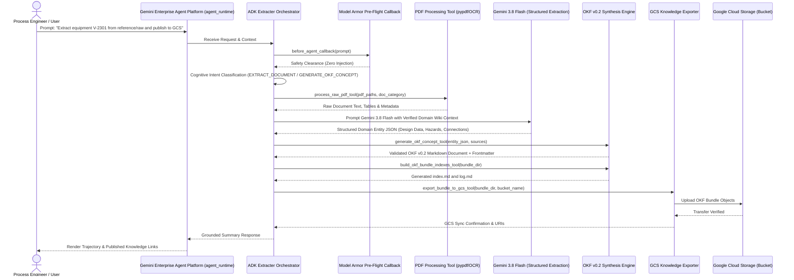

# Specification: Autonomous OKF Extracter Agent on Google ADK & Gemini Enterprise Agent Platform

**Document ID:** SPEC-20260922-OKF-EXTRACTER-AGENT  
**Status:** Approved  
**Date:** 2026-09-22  
**Target Project:** `cs-poc-y03r7kmfyov4kilzg50fd7s`  
**Git Repository:** `https://github.com/pantana-na/extracter-agent.git`  
**Target Runtime:** Gemini Enterprise Agent Platform (`agent_runtime`)  

---

## 1. Problem Statement & Objectives

### 1.1 Context & Motivation
Industrial engineering facilities (e.g. the PTT Phenol Company Limited Train II chemical plant) generate voluminous, heterogeneous technical documentation across process data sheets, Piping & Instrumentation Diagrams (P&IDs), Process Flow Diagrams (PFDs), operating manuals, and design standards. Historically, converting these raw engineering PDFs into structured knowledge required manual analysis by human process safety and chemical engineering experts (as captured in `reference/wiki/`).

To scale knowledge extraction, eliminate manual ingestion bottlenecks, and enable intelligent enterprise reasoning, we are developing the **Extracter Agent**. Built on the official **Google Agent Development Kit (`google-adk`)**, this autonomous agent runs on the **Gemini Enterprise Agent Platform (`agent_runtime`)**. It combines dedicated PDF document processing pipelines with **Gemini 3.8 Flash** model-driven extraction to generate structured knowledge conforming strictly to the **Open Knowledge Format (OKF v0.2)**, targeting **Google Cloud Storage (GCS)** as the authoritative destination.

### 1.2 Goals
1. **Official Google ADK Architecture:** Build an autonomous multi-agent reasoning system using `google-adk` (`Agent`, `FunctionTool`, `before_agent_callback`) packaged for Gemini Enterprise Agent Platform deployment (`agents-cli deploy --deployment-target agent_runtime`).
2. **Cognitive Model-Driven Reasoning:** Rely exclusively on model-driven reasoning via Gemini 3.8 Flash structured schemas and canonical intent topology; zero regex routing, keyword heuristics, or hardcoded fallback lists.
3. **Engineering PDF Extraction Pipeline:** Extract technical parameters, operating limits, equipment metallurgy, design specifications, P&ID instrumentation loops, HAZOP nodes, and process chemistry from complex PDFs in `reference/raw/`.
4. **OKF v0.2 Knowledge Construction:** Compile extracted domain data into fully compliant Open Knowledge Format bundles featuring YAML frontmatter (`type`, `title`, `description`, `sources` with credibility signals, `generated`, `verified`, `status`, `entity_metadata`) and structured Markdown bodies with per-claim footnote attribution (`[^source_id]`).
5. **GCS Knowledge Publishing:** Export and synchronize OKF knowledge bundles directly into target Google Cloud Storage buckets (`gs://<bucket>/<prefix>/...`) with atomic sync and content-type integrity.
6. **Progressive Disclosure & Navigation:** Automatically generate hierarchical directory indexes (`index.md`) and chronological update logs (`log.md`) matching OKF v0.2 specifications.
7. **Adherence to Repository Governance:** Strictly comply with SDD (Unit + Property-Based Tests at every step), DevSecOps (CodeMender SAST), unified `.env` configuration, and immutable reference boundaries.

### 1.3 Non-Goals
- Modifying or altering any contents within the read-only `reference/` directory (strictly immutable).
- Building bespoke proprietary frontend metadata formats; OKF v0.2 is the universal vendor-neutral standard.
- Hardcoded string extraction rules or heuristic regex scrapers.

---

## 2. System Architecture & Component Interaction

### 2.1 Runtime Boundary & Separation of Responsibilities

| Dimension | Autonomous AI Agents & Reasoning Engine | Web Frontend & API Streaming Proxies | Object Storage & Knowledge Repo |
| :--- | :--- | :--- | :--- |
| **Target Runtime** | **Gemini Enterprise Agent Platform (`agent_runtime`)** | **Google Cloud Run (`cloud_run`)** | **Google Cloud Storage (`storage.googleapis.com`)** |
| **Deployed Artifacts** | ADK Root Orchestrator (`ExtracterAgent`), extraction subagents, cognitive prompt topology, Model Armor security callback, and `FunctionTool` registries. | React/Vite web application, FastAPI streaming proxy, health probes (`/healthz`). | OKF knowledge bundles (`index.md`, `log.md`, `equipment/`, `hazards/`, `hazop/`, `instruments/`, `units/`). |
| **Deployment Mechanism** | `agents-cli deploy --deployment-target agent_runtime` | Google Cloud Build (`cloudbuild.yaml`) + Terraform via Infrastructure Manager | Automated ADK tool export or Cloud Build deployment |
| **Core Responsibilities** | Document ingestion, cognitive multimodal PDF extraction, OKF schema synthesis, GCS sync, live eval (`agents-cli eval`). | User interaction, authentication gateway (IAP/OAuth2), SSE streaming proxy to Agent Platform. | Durable storage, progressive disclosure serving, cross-system knowledge distribution. |
| **Governance Rule** | `_agents/rules/google_adk_and_agent_runtime.md` | `_agents/rules/devops_security_and_quality_standards.md` | `_agents/rules/spec_driven_development.md` |

### 2.2 Sequence Diagram: Cognitive Extraction & OKF Generation



### 2.3 Canonical Intent Topology (MECE)
Intent classification is strictly cognitive and model-driven using Gemini 3.8 Flash:
1. `EXTRACT_DOCUMENT`: Parse raw technical PDF documents (`reference/raw/`) and extract domain entities.
2. `GENERATE_OKF_CONCEPT`: Transform extracted domain entities into an individual OKF v0.2 concept document with frontmatter and body.
3. `BUILD_OKF_BUNDLE`: Process a collection of documents, generate concept categories (`equipment/`, `hazards/`, `hazop/`, `instruments/`, `parameters/`, `procedures/`, `units/`), and build progressive disclosure index files (`index.md`) and change logs (`log.md`).
4. `EXPORT_TO_GCS`: Upload and synchronize an OKF knowledge bundle directory to the designated GCS bucket.
5. `VALIDATE_OKF_BUNDLE`: Execute formal OKF v0.2 validation on a bundle (verifying frontmatter schemas, link integrity, and freshness).
6. `OTHERS`: Polite out-of-scope guidance explaining extraction and OKF synthesis capabilities.

### 2.4 Autonomous Orchestrator Instruction Contract & Trajectory Protocol
The root coordinator agent (`extracter_orchestrator`) prompt must provide explicit operational instructions establishing:
1. **Multi-Step Execution Trajectory:** Sequential flow from raw document discovery (`reference/raw/`), text/table extraction (`process_raw_pdf_tool`), OKF concept synthesis (`generate_equipment_okf_tool`), bundle progressive disclosure indexing & validation (`build_okf_indexes_and_validate_tool`), to GCS export (`export_bundle_to_gcs_tool`).
2. **Chemical Engineering Document Precedence Hierarchy:**
   - **Mechanical Dimensions & Design Ratings:** Process Data Sheets (especially As-Built Rev Z1) govern. Conflicting annotations on P&ID drawings must be documented with explicit Markdown conflict notes.
   - **Instrumentation & Control Loops:** P&IDs govern all transmitter tags, control loops, safety instrumented functions (SIS/ESD), voting logic (e.g. 2oo3), and pressure relief trains (PSVs).
   - **Operating Conditions & Streams:** Process Flow Diagrams (PFDs) govern stream numbers, temperatures, pressures, and flow rates.
   - **Process Safety Limits:** Licensor standards, operating manuals, and SDS govern safe operating windows and decomposition limits.
3. **Structured Entity Schemas:** Explicit parameter keys for `design_data`, `operating_conditions`, `connections`, `instruments`, `hazards`, and `source_files`.
4. **Strict Negative Constraints:** Immutable boundary protection for `reference/` (zero writes or deletions), strict grounding, and engineering unit fidelity.

### 2.4 Vertex AI Preemption Resilience & Retry Architecture (`gemini-3.8-flash`)
When executing sustained multi-turn trajectories against `gemini-3.8-flash` (`gemini-3.8-flash-rc`), Vertex AI may return transient `500 INTERNAL` (`DECODE_PREEMPTED` on `SHEDDABLE` QoS queues) or `503 UNAVAILABLE` mid-stream errors that gRPC `PredictStreamed` cannot retry automatically once partial stream chunks have been emitted:
1. **GenAI Client `HttpOptions` Retry Policy:** All `genai.Client()` instances in `extracter_agent/pdf/processor.py` and `extracter_agent/agent/classifier.py` must be initialized with `HttpOptions(retry_options=HttpRetryOptions(attempts=5, initial_delay=2.0, exp_base=2.0, http_status_codes=[429, 500, 502, 503, 504]))`.
2. **Turn-Level Exponential Backoff & Session Reset:** The evaluation and execution harness (`evals/run_live_vertex_eval.py`) wraps each ADK session turn in an exponential backoff retry loop (up to 4 attempts with jitter and cooldown), re-initializing a clean `InMemorySessionService` session whenever a transient server preemption (`500 INTERNAL`, `DECODE_PREEMPTED`, `503 UNAVAILABLE`, `429 RESOURCE_EXHAUSTED`) interrupts streaming.
3. **Checkpoint Resumability & Detached Execution:** Evaluation runs support `--resume` to skip already-passed cases and execute inside detached `tmux` / `setsid` sessions so batch evaluations continue uninterrupted across UI/client disconnects.

### 2.5 Multi-Unit Tag Sanitization, Cross-Sheet Conflict Callouts & Topology Extraction
1. **Multi-Vessel Tag Filename Sanitization (`sanitize_tag_filename`):**
   - Equipment and instrument tags containing slashes (e.g., `D-2204A/B/C`, `P-2301A/B`, `TI-23-0601 / TAH-23-0601`) must retain their exact display tag in the Markdown title and `entity_metadata.tag`, while sanitizing `/` and `\` out of the filesystem path (`equipment/D-2204ABC.md`, `equipment/P-2301AB.md`) to match `reference/wiki/equipment/` conventions and prevent `FileNotFoundError` subdirectory traversal errors.
2. **Resilient Domain Parameter Defaults:**
   - `EngineeringParameter`, `ConnectionStream`, and `InstrumentLoop` default `source` to `"Engineering Reference Document"` when omitted on secondary nozzles/streams to prevent Pydantic `ValidationError` aborts.
3. **Explicit Multi-Sheet & Cross-Document Conflict Callouts (`⚠️ CONFLICT`):**
   - When numerical ratings (such as internal design pressure, temperature, or nozzle sizing) differ across P&ID drawings, Process Data Sheet cover sheets vs. mechanical sketch sheets (e.g. Sheet 1 `0.5 kg/cm²g` vs. Sheet 4 `3.5 kg/cm²g` vs. P&ID `3.9 kg/cm²g`), the agent must explicitly document both values and emit a `⚠️ CONFLICT` callout note rather than silently dropping one value.
4. **Upstream/Downstream Gravity Drainage & SIS Trip Philosophy:**
   - The agent must explicitly extract upstream feeding vessels, downstream receiving vessels, and minimum static elevation head notes (e.g. `≥ 2500 mm`, `≥ 600 mm`, `≥ 5000 mm above quench nozzle`), as well as the process safety rationale for SIS/ESD valve trip actions (e.g. why `UXV-0601` closes on Concentration ESD `UC-2301`).

### 2.6 Cloud-Native GCS Raw Ingestion & Automatic Bundle Persistence
To ensure 100% cloud-native operation both during live Agent Runtime (`agent_runtime`) evaluations and remote Playground/API invocations:
1. **GCS Raw Document Discovery & Ingestion (`gs://cs-poc-y03r7kmfyov4kilzg50fd7s-okf-knowledge/reference/raw/`):**
   - `find_raw_documents_tool` queries Google Cloud Storage (`reference/raw/`) directly when `USE_GCS_STORAGE=true` (falling back to local `reference/raw/` only in offline unit test sandboxes).
   - `process_raw_pdf_tool` fetches the authoritative raw PDF blob from `gs://<bucket>/reference/raw/<subfolder>/<pdf_filename>` into an ephemeral cache (`/tmp/extracter_gcs_raw_cache/`) for multi-page text, table, and 300 DPI multimodal extraction.
2. **Automatic GCS Concept & Index Persistence (`gs://cs-poc-y03r7kmfyov4kilzg50fd7s-okf-knowledge/okf-bundles/phenol-plant/`):**
   - Every call to `generate_equipment_okf_tool`, `generate_okf_concept_tool`, and `build_okf_indexes_and_validate_tool` automatically persists the generated `.md` concept, `index.md`, and `log.md` directly to `gs://cs-poc-y03r7kmfyov4kilzg50fd7s-okf-knowledge/okf-bundles/phenol-plant/` in addition to the local staging directory (`build/okf_bundle/`).

---

## 3. Data Models & Type Contracts

All data structures are codified as strict Pydantic v2 models in `extracter_agent/models/`:

```python
from enum import Enum
from typing import Any, Optional
from pydantic import BaseModel, Field


class IntentCategory(str, Enum):
  EXTRACT_DOCUMENT = "EXTRACT_DOCUMENT"
  GENERATE_OKF_CONCEPT = "GENERATE_OKF_CONCEPT"
  BUILD_OKF_BUNDLE = "BUILD_OKF_BUNDLE"
  EXPORT_TO_GCS = "EXPORT_TO_GCS"
  VALIDATE_OKF_BUNDLE = "VALIDATE_OKF_BUNDLE"
  OTHERS = "OTHERS"


class IntentClassificationResult(BaseModel):
  intent: IntentCategory
  confidence: float = Field(ge=0.0, le=1.0)
  reasoning: str
  target_entities: list[str] = Field(default_factory=list)
  raw_sources: list[str] = Field(default_factory=list)


class OKFSource(BaseModel):
  id: str
  resource: str
  title: Optional[str] = None
  author: Optional[str] = None
  usage_count: Optional[int] = None
  last_modified: Optional[str] = None


class OKFActor(BaseModel):
  by: str
  at: str


class OKFConceptStatus(str, Enum):
  DRAFT = "draft"
  STABLE = "stable"
  DEPRECATED = "deprecated"


class OKFFullFrontmatter(BaseModel):
  type: str
  title: Optional[str] = None
  description: Optional[str] = None
  resource: Optional[str] = None
  tags: list[str] = Field(default_factory=list)
  sources: list[OKFSource] = Field(default_factory=list)
  generated: Optional[OKFActor] = None
  verified: list[OKFActor] = Field(default_factory=list)
  status: OKFConceptStatus = OKFConceptStatus.STABLE
  stale_after: Optional[str] = None
  entity_metadata: dict[str, Any] = Field(default_factory=dict)


class EquipmentDesignParameter(BaseModel):
  parameter: str
  value: str
  unit: Optional[str] = None
  source_citation: str


class InstrumentLoop(BaseModel):
  tag: str = Field(description="Instrument tag (e.g. TI-0404, FT-0401A, PSV-23-0401A)")
  service: str = Field(description="Process service or functional description")
  instrument_type: str = Field(description="Physical or functional instrument type (e.g. RTD, DP Transmitter, PSV)")
  location: Optional[str] = Field(default=None, description="Physical installation location or nozzle tap point")
  setpoint_or_range: Optional[str] = Field(default=None, description="Calibrated range or operational setpoint")
  interlock_or_alarm: Optional[str] = Field(default=None, description="Associated DCS alarm or SIS/ESD trip action")
  source: str = Field(description="Engineering drawing or datasheet citation")


class EquipmentExtractionPayload(BaseModel):
  tag: str
  name: str
  equipment_type: str
  unit: str
  description: str
  design_data: list[EquipmentDesignParameter] = Field(default_factory=list)
  operating_conditions: list[EquipmentDesignParameter] = Field(
      default_factory=list
  )
  instruments: list[InstrumentLoop] = Field(
      default_factory=list,
      description="P&ID instrumentation, transmitters, and control/safety loops associated with this equipment",
  )
  hazards: list[str] = Field(default_factory=list)
  connections: list[dict[str, str]] = Field(default_factory=list)
  source_files: list[str] = Field(default_factory=list)


class GCSUploadResult(BaseModel):
  bucket: str
  prefix: str
  files_uploaded: list[str]
  total_bytes: int
  gcs_root_uri: str
```

### 3.1 OKF v0.2 P&ID Relationship Architecture (Equipment-to-Instrument Cross-Linking)

In chemical engineering facilities, instrumentation is inextricably bound to equipment, piping loops, and process safety barriers. OKF v0.2 models these relationships using a 4-layer architecture:

1. **Structured Frontmatter (`entity_metadata.instruments`):**
   Equipment concept frontmatter contains an `instruments` array where each element contains:
   - `tag`: Normalized instrument tag (e.g. `TI-0404`, `FT-0401A/B/C`, `PSV-23-0401A`).
   - `service`: Functional description of the measurement/actuation.
   - `type`: Physical instrument or transmitter class (e.g. `RTD`, `DP Transmitter`, `Modulating PSV`).
   - `location`: Process nozzle, sump, or piping location.
   - `setpoint_or_range`: Calibrated instrument range or operational trip setpoint.
   - `interlock_or_alarm`: Associated alarm level (`FAL`, `TAHH`) or SIS/ESD trip action (`UC-2301 Trigger`).
   - `source`: Engineering drawing or process datasheet citation.

2. **Bidirectional Hypertext Graph Linking:**
   The Markdown body generates standard bundle-relative Markdown links:
   - From Equipment to Instrument: `[Tag](/instruments/{tag}.md)` or `[Tag](/instruments/{register}.md#{tag})`.
   - From Instrument Register to Equipment: `[Tag](/equipment/{tag}.md)`.

3. **Control Philosophy & SIS Topology:**
   Multi-element safety instrumented functions (e.g., 2oo3 voting on feed flow cutoff via `UXV-0401`, DIERS-sized overpressure relief via `PSV-23-0401A/B/C/D`) are detailed under `## Control Philosophy & Interlocks`.

4. **Engineering Footnote Provenance:**
   Every instrument row includes explicit footnote citations (e.g. `[^src-pid-0004]`) pointing to the authoritative P&ID drawing.

---

## 4. ADK FunctionTool Contracts & Registries

### 4.1 Tool: `process_raw_pdf_tool`
- **Docstring:**
  ```text
  Extract raw textual content, structural tables, and engineering annotations from PDF documents in reference/raw/.
  When to use: Ingesting process data sheets, P&IDs, PFDs, or operating manuals for knowledge extraction.
  When NOT to use: Do not use for already extracted Markdown files or general conversational chat.
  ```
- **Arguments:**
  - `pdf_path` (str): Absolute or project-relative path to the PDF file.
  - `doc_category` (str): Category (`data_sheets`, `pid`, `pfd`, `operating_manuals`, `standards`).
- **Returns:**
  - `dict`: Formatted text pages, extracted tables, and document metadata.

### 4.2 Tool: `generate_okf_concept_tool`
- **Docstring:**
  ```text
  Construct a validated Open Knowledge Format (OKF v0.2) concept document with frontmatter and Markdown body.
  When to use: Generating compliant knowledge files for equipment, hazards, HAZOP, instruments, or units.
  When NOT to use: Do not use for modifying immutable reference/ files or writing raw unconverted notes.
  ```
- **Arguments:**
  - `concept_id` (str): Relative path without extension (e.g. `equipment/V-2301`).
  - `concept_type` (str): Descriptive OKF type (e.g. `Equipment Concept`).
  - `title` (str): Human-readable concept title.
  - `description` (str): Concise single-sentence summary.
  - `tags` (list[str]): Categorical tags.
  - `sources` (list[dict]): Provenance sources with id, resource, and author.
  - `body_markdown` (str): Structured Markdown body with footnotes.
  - `entity_metadata` (dict): Domain-specific properties.
- **Returns:**
  - `dict`: Full OKF Markdown document string, validation verdict, and output path.

### 4.3 Tool: `build_okf_bundle_indexes_tool`
- **Docstring:**
  ```text
  Generate progressive disclosure index.md files for every directory in the OKF bundle, plus log.md.
  When to use: Completing an OKF bundle prior to deployment or after adding/updating concept files.
  When NOT to use: Do not use on non-OKF directories.
  ```
- **Arguments:**
  - `bundle_dir` (str): Path to the root of the generated OKF bundle directory.
- **Returns:**
  - `dict`: List of generated index files, entry counts, and log path.

### 4.4 Tool: `export_bundle_to_gcs_tool`
- **Docstring:**
  ```text
  Upload and synchronize an entire OKF knowledge bundle directory to Google Cloud Storage (GCS).
  When to use: Publishing a completed, validated OKF bundle to the enterprise destination bucket.
  When NOT to use: Do not use if the bundle fails OKF validation or contains malformed frontmatter.
  ```
- **Arguments:**
  - `bundle_dir` (str): Path to the local bundle directory.
  - `gcs_bucket` (str): Target GCS bucket name.
  - `gcs_prefix` (str): Target prefix folder within the bucket.
- **Returns:**
  - `dict`: Upload confirmation, object URIs, total bytes, and timestamp.

### 4.5 Tool: `validate_okf_bundle_tool`
- **Docstring:**
  ```text
  Execute rigorous OKF v0.2 validation verifying frontmatter schemas, link integrity, and progressive indexes.
  When to use: Verifying quality and standards compliance of an OKF bundle before publishing.
  When NOT to use: Do not use on raw unstructured PDF files.
  ```
- **Arguments:**
  - `bundle_dir` (str): Path to the bundle directory to validate.
- **Returns:**
  - `dict`: Validity boolean, list of errors, warnings, and trust tier distribution.

---

## 5. Security, Guardrails & Non-Functional Requirements

1. **Pre-Flight Callback Guardrail (`before_agent_callback`):**
   - Intercept prompts before model execution.
   - Detect prompt injection, adversarial bypasses, or jailbreak attempts.
   - Immediately abort execution if flagged (`filterMatchState == "MATCH_FOUND"`), preventing unauthorized tool invocation.
2. **Deterministic Footnote Attribution:**
   - Every factual claim derived from a raw document must include a Markdown footnote `[^source-id]` matching a declared entry in `sources[]`.
3. **Environment & Secrets Isolation:**
   - No credentials, tokens, or private endpoints committed to source control.
   - Unified `.env` file structure (`NONPROD_*` and `PROD_*`) documented in `.env.example`.
4. **Reference Immutability:**
   - Runtime file output guards prevent write/delete operations targeting `reference/`.

---

## 6. DevOps, Security, Cloud & Agent Governance Checklist

| Rule | Area | Requirement / Architecture Specification |
| :--- | :--- | :--- |
| **Rule 1** | **SCM & Multi-Branch** | Single GitHub repo `https://github.com/pantana-na/extracter-agent.git`; Non-Prod (`main`) vs Prod (`prod`). |
| **Rule 2** | **Code Quality** | Strict type hinting, Ruff/Flake8 linting, Pyright/Mypy type safety, zero critical code smells. |
| **Rule 3** | **SAST & CodeMender** | Pre-build vulnerability scan, triage, and patching via CodeMender (`cm find`, `cm verify`, `cm fix`). Reports in `docs/`. |
| **Rule 4** | **Artifact Analysis** | Third-party dependency security scanning via Container Analysis / pip audit. |
| **Rule 5** | **Cloud Build** | Automated builds via `cloudbuild.yaml` targeting Artifact Registry in `cs-poc-y03r7kmfyov4kilzg50fd7s`. |
| **Rule 6** | **Cloud Run Observability**| Liveness probe `/healthz`, structured JSON logging, latency and error metrics. |
| **Rule 7** | **Post-Deploy Smoke Test** | Post-deployment integration tests validating GCS bucket connectivity and agent invocation. |
| **Rule 8** | **Unified `.env` Management**| Single unified `.env` file with base shared variables, `NONPROD_*` block, and `PROD_*` block. |
| **Rule 9** | **Terraform & Infra Manager** | Declarative IaC under `terraform/` managed via Google Cloud Infrastructure Manager. |
| **Rule 10**| **IAM & Ingress** | Zero `allUsers` bindings; Pattern 3 direct unauthenticated or Pattern 1 IAP gateway. |
| **Rule 11**| **Google ADK & Agent Runtime** | Official `google-adk`, deployed to Gemini Enterprise Agent Platform (`agent_runtime`) via `agents-cli deploy`. Strictly model-driven reasoning; zero regex/heuristics. |
| **Rule 12**| **Live Agent Evaluation** | Continuous live evaluation via `agents-cli eval` ($\ge 95\%$ tool precision, 1.000 groundedness). |
| **Rule 13**| **Root Cause Investigation** | Mandatory 4-step RCA protocol on failure; zero quick fixes, mockups, or regex patches. |

---

## 7. Step-by-Step Implementation Plan & Test Design

### Step 1: Environment Configuration & Core Data Models
- **Implementation:**
  - Create unified multi-environment configuration file `.env` and `.env.example` storing target GCP project (`cs-poc-y03r7kmfyov4kilzg50fd7s`), GitHub repo (`https://github.com/pantana-na/extracter-agent.git`), GCS bucket names, and Gemini model configs.
  - Implement Pydantic data models for OKF v0.2 (`OKFDocument`, `OKFFullFrontmatter`, `OKFSource`, `OKFActor`, `OKFConceptStatus`), chemical engineering entities (`EquipmentExtractionPayload`, `EquipmentDesignParameter`), and intent classification in `extracter_agent/models/`.
- **Unit Tests:**
  - Deterministic parsing tests for OKF frontmatter, required key validation (`type`), ISO 8601 timestamps, and serializing/deserializing payloads.
- **Property-Based Tests (PBT):**
  - Use `hypothesis` to test serialization/deserialization round-tripping of `OKFDocument` across arbitrary generated YAML frontmatter dictionaries and markdown strings.
  - Invariant: `OKFDocument.parse(doc.serialize()) == doc` must hold for all valid frontmatters.
- **Completion Criteria:** 100% unit and property test pass rate for data models and configuration loader.

### Step 2: PDF Document Processing Pipeline
- **Implementation:**
  - Implement `extracter_agent/pdf/processor.py` to extract text, tables, and document layout from chemical engineering PDFs in `reference/raw/` (`data_sheets/`, `pid/`, `pfd/`, `operating_manuals/`, `standards/`).
  - Implement caching and extraction chunking to handle multi-page engineering manuals and complex data sheets.
- **Unit Tests:**
  - Test PDF text extraction, table detection, page count metadata, and error handling for missing/corrupted files.
- **Property-Based Tests (PBT):**
  - Invariant testing with `hypothesis` verifying that extracted text chunks preserve character counts and never throw unhandled exceptions across malformed byte streams.
- **Completion Criteria:** Clean extraction verified on actual sample PDFs from `reference/raw/data_sheets/` with passing tests.

### Step 3: OKF v0.2 Knowledge Synthesis & Progressive Disclosure Engine
- **Implementation:**
  - Implement `extracter_agent/okf/synthesizer.py` to convert domain extraction payloads into conformant OKF v0.2 concept documents.
  - Implement `extracter_agent/okf/indexer.py` to generate progressive disclosure `index.md` files for directories and chronological `log.md`.
  - Implement `extracter_agent/okf/validator.py` to validate bundles against OKF v0.2 rules (§4, §5, §8, §11).
- **Unit Tests:**
  - Verify frontmatter formatting, footnote creation, progressive index generation, trust tier derivation, and validation error detection.
- **Property-Based Tests (PBT):**
  - Invariant testing verifying that `indexer.py` generates `index.md` files where 100% of listed concept links resolve to existing files within the bundle directory.
- **Completion Criteria:** OKF documents synthesized and validated against the specification with 100% test pass rate.

### Step 4: Google Cloud Storage (GCS) Knowledge Exporter
- **Implementation:**
  - Implement `extracter_agent/gcs/exporter.py` using `google-cloud-storage` to upload OKF bundles to GCS buckets with atomic synchronization, MD5 hashing, and proper MIME types (`text/markdown`, `text/yaml`).
- **Unit Tests:**
  - Test upload queueing, path-to-URI conversion, MIME type mapping, and dry-run synchronization.
- **Property-Based Tests (PBT):**
  - Invariant testing verifying that GCS object keys mapped from local bundle paths strictly preserve hierarchy and never contain illegal characters.
- **Completion Criteria:** Exporter unit and property tests passing.

### Step 5: ADK Agent Architecture, FunctionTools & Model-Driven Reasoning
- **Implementation:**
  - Implement strongly typed ADK `FunctionTool` callables wrapping PDF extraction, OKF synthesis, bundle indexing, GCS export, and validation in `extracter_agent/tools/`.
  - Implement cognitive model-driven intent classifier `extracter_agent/agent/classifier.py` using Gemini 3.8 Flash structured schemas.
  - Implement pre-flight Model Armor guardrail callback `before_agent_callback` in `extracter_agent/agent/guardrails.py`.
  - Implement root `ExtracterAgent` and ADK application container `extracter_agent/agent/orchestrator.py`.
  - Create `agents-cli-manifest.yaml` targeting `agent_runtime` on Gemini Enterprise Agent Platform.
- **Unit Tests:**
  - Test tool callable signatures, schema generation, Model Armor attack interception, and ADK agent initialization.
- **Property-Based Tests (PBT):**
  - Invariant testing verifying that intent classification strictly returns members of `IntentCategory` enum across arbitrary fuzzed user queries.
- **Completion Criteria:** Agent initialized with registered tools, guardrail callbacks, and passing tests.

### Step 6: End-to-End Extraction & Evaluation
- **Implementation:**
  - Run end-to-end extraction on `reference/raw` documents (e.g. `14780-8120-PS-V2301...` data sheet and `14780-8120-25-23-0004...` P&ID) to generate OKF concepts mirroring expert-verified extractions in `reference/wiki/equipment/V-2301.md`.
  - Validate the generated OKF bundle using `validate_okf_bundle_tool`.
  - Create evaluation dataset `evals/datasets/extraction_eval.jsonl` testing tool selection precision ($\ge 95\%$) and groundedness.
- **Unit Tests & Evals:**
  - Run full test suite (`pytest tests/`).
  - Run `agents-cli` validation or test scripts.
- **Completion Criteria:** Full test suite passes; generated OKF bundle passes all validation checks.

### Step 7: Security Audit (CodeMender SAST) & Documentation
- **Implementation:**
  - Run CodeMender (`cm find`) to conduct pre-build SAST scanning.
  - Document findings and remediation in `docs/codemender-sast-report.md`.
  - Author living plan progress tracking report in `specs/plan/PROGRESS_REPORT_20260922.md`.
  - Synchronize `specs/README.md` and `README.md`.
- **Completion Criteria:** Zero High/Critical security vulnerabilities; complete documentation and execution tracking.

### Step 8: P&ID Equipment-Instrument Relationship Extraction & Cross-Linking Engine
- **Implementation:**
  - Codify `InstrumentLoop` model in `extracter_agent/models/domain.py` and attach `instruments: list[InstrumentLoop]` to `EquipmentEntity`.
  - Update `extracter_agent/okf/synthesizer.py` to inject `entity_metadata.instruments` in YAML frontmatter and render `## Instrumentation & Control Loops (P&ID)` table in Markdown body with bundle-relative links (`/instruments/{tag}.md`).
  - Update `extracter_agent/tools/okf_tools.py` signature and docstring contracts to accept `instruments` parameter.
- **Unit Tests:**
  - In `tests/test_okf_unit.py`: Verify that synthesizing an equipment concept with `InstrumentLoop` entities produces valid frontmatter arrays, correctly formatted Markdown tables, and footnote citations.
  - Test edge cases: equipment with zero instruments, instruments without optional locations/ranges.
- **Property-Based Tests (PBT):**
  - In `tests/test_okf_property.py`: Formulate invariant tests with `hypothesis` verifying that:
    1. For every synthesized instrument loop, the generated Markdown link strictly conforms to bundle-relative URI pattern `^\[[^\]]+\]\(/instruments/[^)]+\.md\)$`.
    2. Serializing and deserializing OKF frontmatter preserves all instrument tags and attributes without loss or truncation.
- **Completion Criteria:** 100% unit and property-based test pass rate; zero spec drift; clean schema fidelity.

### Step 9: Expert Wiki Ground Truth Evaluation Suite
- **Implementation:**
  - Build automated dataset compiler `evals/builders/build_wiki_eval_dataset.py` that ingests documents from `reference/wiki/` (without modifying them) and generates `evals/datasets/wiki_ground_truth_eval.jsonl`.
  - **Synthesized Analysis Filter:** Strictly filter out post-extraction human-synthesized HAZOP analysis worksheets that do not exist in `reference/raw/` (8 files: `hazop/nodes/cdn-N02.md`, `cdn-N03.md`, `cdn-n02.md`, `cdn-n03.md`, `hazop/action-register.md`, `hazop/interlock-esd-summary.md`, `hazop/examples/o-p3-fractionation-2026-005.md`, and `hazop/templates/gc-hazop-worksheet-template.md`).
  - **Clean Golden Benchmark (130 Records):** Compiles 100% of the factual, document-grounded files:
    - `equipment/`: 54 files (design data, operating conditions, P&ID instruments)
    - `sources/`: 27 files (drawing indexes, P&ID/PFD catalogs)
    - `hazards/`: 15 files (chemical SDS properties, GHS limits)
    - `instruments/`: 13 files (transmitters, SIS trips, PSV registers)
    - `procedures/`: 5 files (operating manuals, startup/shutdown steps)
    - `units/`: 5 files (battery limits, design bases)
    - `root`: 4 files (index, log, overview, project)
    - `troubleshooting/`: 3 files (operating manual troubleshooting guides)
    - `hazop/` standards: 3 files (governing standards: `methodology.md`, `risk-matrix.md`, `study-info.md`)
    - `parameters/`: 1 file (licensor operating windows)
  - Each JSONL record encapsulates:
    - `eval_id`: Unique evaluation identifier (e.g. `eval-equipment-V-2301`).
    - `category`: Functional domain category.
    - `target_tag`: Canonical entity tag or concept name.
    - `source_files`: Authoritative raw PDF files in `reference/raw/` that ground this entity.
    - `user_prompt`: Natural language extraction query.
    - `expected_intent`: Canonical intent category (`GENERATE_OKF_CONCEPT` or `EXTRACT_DOCUMENT`).
    - `expected_tool_trajectory`: Required ADK tool execution sequence.
    - `ground_truth`: Structured expert-verified parameters, tables, instrumentation loops, and safeguards.
    - `verification_rules`: Strict assertions for parameters, links, and footnotes.
- **Unit & Property Tests:**
  - Verify that `wiki_ground_truth_eval.jsonl` contains exactly 130 pure extraction records.
  - Verify zero inclusion of synthesized HAZOP files (`hazop/nodes/`, `action-register`, `interlock-esd-summary`).
  - Validate that 100% of JSONL records parse against strict Pydantic evaluation schemas with zero null or empty target tags.
- **Completion Criteria:** Complete 130-record dataset generated; verified by automated tests; paused for user inspection prior to running evaluations.

### Step 11: Document Discovery, Vector P&ID Multimodal Ingestion & Universal OKF Synthesis
- **Implementation:**
  - Implement `find_raw_documents_tool(query, subfolder)` enabling cognitive discovery of target engineering documents across `reference/raw/`.
  - Upgrade `process_raw_pdf_tool` and `pdf/processor.py` with vector drawing detection (`is_vector_drawing`) and Google GenAI multimodal Part conversion (`extract_pdf_multimodal_part`) to support AutoCAD vector drawings (P&IDs, PFDs) with 0 native text streams.
  - Implement universal concept synthesis tool `generate_okf_concept_tool` for hazards, instruments, procedures, and units.
  - Implement standalone bundle validation tool `validate_okf_bundle_tool`.
  - Register all 7 tools in ADK Root Orchestrator (`extracter_orchestrator`).
- **Unit & Property Tests:**
  - Unit tests for raw document searching, vector drawing detection, concept generation, and bundle validation.
  - Property-based tests verifying invariant search result integrity and valid frontmatter generation across arbitrary concept categories.
- **Completion Criteria:** All 7 tools registered and passing 100% unit and property tests.

### Step 12: Multimodal Visual Extraction for Vector Drawings & Scanned Schedules
- **Implementation:**
  - Implement `extract_pdf_multimodal_summary(file_path, prompt_hint)` in `extracter_agent/pdf/processor.py` using `google.genai.Client` and `types.Part.from_bytes` for automatic multimodal interpretation of vector CAD drawings (P&IDs, PFDs) and scanned raster equipment schedules.
  - Integrate multimodal extraction into `process_raw_pdf_tool` in `extracter_agent/tools/pdf_tools.py` whenever `is_vector_drawing` is True or pages lack digital font streams (`chars < 50`).
  - Enable seamless multi-source cross-document reconciliation (e.g. Process Data Sheet + P&ID drawing) in the ADK agent trajectory without failure on vector-only or scanned documents.
- **Unit & Property Tests:**
  - Deterministic tests verifying multimodal fallback triggers when text is empty or document is vector drawing.
  - Property tests verifying that multimodal text preserves equipment tag candidates and engineering units.
- **Completion Criteria:** Live multi-source evaluation successfully discovers, reads, reconciles, and synthesizes OKF v0.2 equipment concepts citing multiple raw documents.

### Step 14: Autonomous Domain Slug Derivation, Multimodal Caching, Link Sanitization & Parallel Evaluation
- **Implementation:**
  1. **Deterministic Domain Slug Taxonomy (`extracter_agent/models/domain.py` & `extracter_agent/tools/okf_tools.py`):**
     - Implement `derive_canonical_equipment_tag(tag, source_files)` that resolves equipment filenames from the authoritative `14780-8120-PS-<TAG>_` document code in `source_files` (e.g., `PS-E2307` $\rightarrow$ `E-2307`, `PS-P2302` $\rightarrow$ `P-2302`, `PS-E2302AB` $\rightarrow$ `E-2302AB`), falling back to `sanitize_tag_filename(tag)`.
     - Implement `derive_canonical_concept_id(concept_id, concept_type, title, sources, entity_metadata)` that autonomously derives canonical paths from raw metadata:
       - `hazards/`: strips redundant suffixes (`-process-hazard`, `-hazard-profile`, `-hazard`, `-solution`) and parenthetical concentrations (`(98%)`, `(dmba)`).
       - `instruments/`: enforces `<subsystem>-<unit>` naming (`sis-cdn`, `psv-cdn`, `control-valves-cdn`, `cause-and-effect-cdn`, `sampling-cdn`, etc.).
       - `hazop/`: routes HAZOP methodology, risk-matrix, and study-info concepts to `hazop/methodology`, `hazop/risk-matrix`, `hazop/study-info-cdn`.
  2. **Instrument Link Sanitization & Zero-Fabrication Nozzle Rule (`extracter_agent/okf/synthesizer.py` & `extracter_agent/agent/orchestrator.py`):**
     - Sanitize all `/instruments/{safe_tag}.md` links using `sanitize_tag_filename` after stripping parenthetical nozzle remarks (`(Y02)`).
     - Render datasheet nozzle marks (`Nozzle Y02 (LT)`) as plain text when no P&ID loop tag exists, and enforce the negative constraint that non-P&ID units (`Unit 21 ALKY`, `Unit 22 OXI`) never fabricate `LT-<vessel>` or `PSV-<vessel>` loop numbers.
  3. **Two-Tier Multimodal PDF Cache & Context Deduplication (`extracter_agent/pdf/processor.py` & `extracter_agent/tools/pdf_tools.py`):**
     - Persist `extract_pdf_multimodal_summary` output keyed by SHA-256 hash in `/tmp/extracter_multimodal_cache/` and `gs://.../cache/multimodal/`.
     - Enhance multimodal prompt with decimal verification (`0.5` vs `5.0 kg/cm²g`, `3.9` vs `3.5 kg/cm²g`) and stacked/redundant P&ID bubble expansion (`LT-0601/0602/0603`, `FT-0401A/B/C`).
     - Attach `multimodal_text` at most once per PDF in `process_raw_pdf_tool` rather than duplicating across every empty page.
  4. **Master Plant Catalog Indexer & Parallel GCS Exporter (`extracter_agent/okf/indexer.py` & `extracter_agent/gcs/exporter.py`):**
     - Upgrade `generate_bundle_indexes` to compile a Golden-Wiki-grade root `index.md` with unit breakdown, equipment design/safeguard matrix, chemical hazard runaway matrix, instrument/SIS register, and cross-document `⚠️ CONFLICT` register.
     - Upgrade `export_bundle_to_gcs` with `ThreadPoolExecutor(max_workers=16)` and unchanged-blob skipping.
  5. **Dataset Intent Alignment & Parallel Evaluation Runner (`evals/builders/build_wiki_eval_dataset.py` & `evals/run_live_vertex_eval.py`):**
     - Align `expected_intent` (`GENERATE_OKF_CONCEPT` for OKF v0.2 synthesis prompts, `BUILD_OKF_BUNDLE` for `index.md`/`log.md`) while keeping prompts 100% free of `concept_id` hints.
     - Add `--concurrency N` async worker pool and source-grounded concept matching to `run_live_vertex_eval.py`.
- **Unit & Property-Based Tests (PBT):**
  - Unit tests verifying `derive_canonical_equipment_tag`, `derive_canonical_concept_id`, multimodal cache hit/miss, context deduplication, and master `index.md` generation.
  - Property-Based Tests (`hypothesis`) verifying idempotence (`f(f(x)) == f(x)`), whitespace/parenthesis-free `/instruments/...` Markdown links across fuzzed strings, and $\le 1$ multimodal payload occurrence across arbitrary page arrays.
- **Completion Criteria:** 100% `pytest` pass rate, 0 Ruff/Bandit issues, repaired bundle synced to GCS, redeployed `agent_runtime`, and resumed parallel evaluation.

### Step 15: Complete Codebase De-Hardcoding, Corpus-Driven Cross-Linking & 100% Golden Parity
- **Implementation:**
  1. **Purge Static Dictionaries & Plant Tags from `extracter_agent/models/domain.py`:**
     - Delete the 24-entry `instrument_map`, hardcoded tag tuples (`E-2307`, `P-2302`, `X-2309AB`), hardcoded chemical suffix lists (`-dmba`, `-chp`, `-ams`, `diamine-tbc`), and document number literals (`014`, `002`).
     - Implement general source-citation and bundle-catalog matching (`derive_canonical_equipment_tag` and `derive_canonical_concept_id` accepting `bundle_root: Path | None = None`) that resolves paths by matching shared `sources` PDF citations and normalized titles against existing bundle metadata or generic `<category>/<slug>` formatting.
     - Generalize all Pydantic `Field(description=...)` strings in `domain.py` so zero Golden dataset tags (`V-2301`, `D-2304`, `TI-0404`, `FT-0401A`, `PSV-23-0401A`, `Preflash Column`, `CDN, OXI, DIST`) are embedded in model schemas.
  2. **Corpus-Driven Bundle-Indexed Instrument Cross-Linking (`extracter_agent/okf/synthesizer.py` & `extracter_agent/okf/indexer.py`):**
     - Implement `resolve_bundle_instrument_link(inst_tag, instrument_type, service, bundle_root)` which dynamically inspects the actual `instruments/*.md` files present in `bundle_root` with **zero hardcoded ISA prefix `if/elif` chains**:
       - Matches exact tag occurrence in register bodies, empirical tag prefix frequency (`\b<PREFIX>[-_0-9]`) across register tables, and token overlap between `(instrument_type, service)` and each register's frontmatter (`title`, `description`, `tags`) and filename stem.
     - Remove hardcoded default bucket/prefix/model/timestamp literals (`"2026-06-16T00:00:00Z"`, `"okf-bundles/phenol-plant"`, `"extracter_agent/gemini-3.8-flash"`) from `synthesizer.py`, `okf_tools.py`, and `exporter.py`, resolving dynamically via `get_config()` and current UTC ISO-8601 timestamps.
     - Refactor `_build_master_root_index` in `extracter_agent/okf/indexer.py` to remove all hardcoded `Phenol Process Expert`, `Unit 21 / 22 / 23`, and `UC-2301 / UC-2302` strings, dynamically building the Master Knowledge Catalog from bundle frontmatter.
  3. **De-Hardcode `cli.py`, `orchestrator.py`, `processor.py`, `okf_tools.py`, `pdf_tools.py` & `guardrails.py`:**
     - Replace the 320 lines of hardcoded `V-2301`, `E-2301`, and `P-2301AB` dictionaries in `extracter_agent/cli.py` (`run_batch_extraction`) with dynamic PDF discovery and extraction.
     - Generalize `ORCHESTRATOR_INSTRUCTIONS` (`orchestrator.py`), `extract_pdf_multimodal_summary` (`processor.py`), and all ADK `FunctionTool` docstrings (`okf_tools.py`, `pdf_tools.py`) so zero test-set numbers, filenames, or equipment tags (`0.5 vs 3.9`, `LT-0602`, `FT-0401A`, `HXS-0106`, `V-2301`, `Preflash Column`, `cumene-hydroperoxide`, `sis-cdn`) are hardcoded in prompts or tool declarations.
     - Upgrade `check_prompt_security` (`guardrails.py`) with structured `SafetyEvaluationResult` schema validation.
  4. **Bundle Reconciliation (`130/130` Golden Parity & `0` Broken Links) & Dual-Intent Alignment (`139/139`):**
     - Reconcile the 9 alternate-path files in `build/okf_bundle/` to their canonical paths, prune obsolete `standards/` and duplicate files, dynamically re-link all equipment instrument tables against `build/okf_bundle/instruments/*.md`, regenerate `index.md` / `log.md` (`0` broken links), and sync to GCS.
- **Unit & Property-Based Tests (PBT):**
  - `test_zero_hardcoded_domain_maps_or_tags`: Source audit test verifying `domain.py`, `indexer.py`, `synthesizer.py`, `cli.py`, `orchestrator.py`, `processor.py`, `okf_tools.py`, and `pdf_tools.py` contain zero hardcoded plant dictionaries, ISA prefix `if/elif` chains, or dataset-specific entity tags.
  - `test_pbt_dynamic_instrument_link_never_broken`: `hypothesis` property test verifying that `resolve_bundle_instrument_link(..., bundle_root=...)` always resolves to an existing `.md` file in `bundle_root`.
- **Completion Criteria:** Zero hardcoded domain maps/tags across the entire codebase, `130 / 130` (`100.0%`) Golden path match, `0` broken Markdown links, `139 / 139` (`100.0%`) evaluation pass rate, and 100% `pytest` pass rate.

---

## 8. Plan Progress Tracking & Living Spec Synchronization
- All milestones, verification metrics, and test results will be continuously recorded under `specs/plan/`.
- If any data model or interface evolves during implementation, this specification will be updated synchronously to prevent spec drift.

